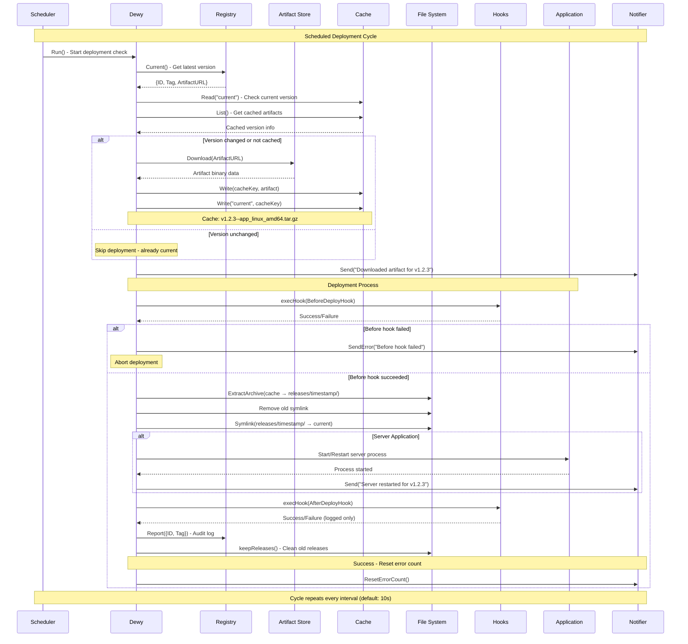

<p align="right"><a href="https://github.com/linyows/dewy/blob/main/README.md">English</a> | 日本語</p>

<p align="center">
  <a href="https://dewy.linyo.ws">
    <br><br><br><br><br><br>
    <picture>
      <source media="(prefers-color-scheme: dark)" srcset="https://github.com/linyows/dewy/blob/main/misc/dewy-dark-bg.svg?raw=true">
      
    </picture>
    <br><br><br><br><br><br>
  </a>
</p>

<p align="center">
  <strong>Dewy</strong> enables declarative deployment of applications in non-Kubernetes environments.
</p>

<p align="center">
  <a href="https://github.com/linyows/dewy/actions/workflows/build.yml">
    
  </a>
  <a href="https://github.com/linyows/dewy/releases">
    
  </a>
  <a href="http://godoc.org/github.com/linyows/dewy">
    
  </a>
  <a href="https://deepwiki.com/linyows/dewy">
    
  </a>
</p>

Dewyは、Kubernetes以外の環境でアプリケーションを宣言的にデプロイするソフトウェアです。
バイナリアプリケーション（主にGo）、静的アセット、コンテナ化されたアプリケーションという複数のデプロイメントモードをサポートします。
Dewyは、指定する「レジストリ」をポーリングし、セマンティックバージョニングで管理された最新のバージョンを検知すると、指定する「アーティファクト」ストアまたはOCIレジストリから自動的にデプロイを行います。
コンテナ化されたアプリケーションの場合、Dewyはヘルスチェック付きのゼロダウンタイムローリングアップデートデプロイメントを提供します。
Dewyは、レジストリ、アーティファクトストア、キャッシュストア、通知の４つのインターフェースから構成されています。
以下はDewyのデプロイプロセスと構成を図にしたものです。

<p align="center">
  
</p>

主な機能
--

- 宣言的プル型デプロイメント
- 複数のデプロイメントモード（バイナリ、アセット、コンテナイメージ）
- コンテナ向けゼロダウンタイムローリングアップデートデプロイメント
- グレースフルリスタート
- 選択可能なレジストリとアーティファクトストア
- Docker Hub、GHCR、GAR、ECRなどのOCIレジストリをサポート
- デプロイ状況の通知
- JSON形式対応の構造化ログ
- オーディットログ

使いかた
--

### Serverコマンド

次のServerコマンドは、registryにgithub releasesを使い、8000番ポートでサーバ起動し、ログレベルをinfoに設定し、slackに通知する例です。

```sh
$ dewy server --registry ghr://linyows/myapp \
  --notifier slack://general?title=myapp -p 8000 -l info -- /opt/myapp/current/myapp
```

### Assetsコマンド

HTMLやCSS、JavaScriptなどの静的ファイルをデプロイします：

```sh
$ dewy assets --registry ghr://linyows/frontend -d /var/www/html -l info
```

### Containerコマンド

ゼロダウンタイムローリングアップデートデプロイメントでコンテナ化されたアプリケーションをデプロイします：

```sh
$ dewy container --registry img://ghcr.io/linyows/myapp \
  --container-port 8080 --health-path /health --replicas 3 -l info
```

レジストリと通知の指定はurlを模擬した構成になっています。urlのschemeにあたる箇所はレジストリや通知の名前です。レジストリの項目で詳しく解説します。

コマンド
--

Dewyには、Server、Assets、Containerの3つの主要なコマンドがあります。
ServerはServer Application用でApplicationのプロセス管理を行い、Applicationのバージョンを最新に維持します。
Assetsはhtmlやcssやjsなど、静的ファイルのバージョンを最新に維持します。
Containerはコンテナ化されたアプリケーションのゼロダウンタイムデプロイメントを実現し、ローリングアップデートをサポートします。

- server
- assets
- container

インターフェース
--

Dewyにはいくつかのインターフェースがあり、それぞれ選択可能な実装を持っています。以下、各インターフェースの説明をします。（もしインターフェースで欲しい実装があればissueを作ってください）

- Registry
- Artifact
- Cache
- Notifier

Registry
--

レジストリは、アプリケーションやファイルのバージョンを管理するインターフェースです。
レジストリは、Github Releases、AWS S3、Google Cloud Storage、OCIレジストリ（Docker Hub、GHCR、GAR、ECR）、GRPCから選択できます。

#### 共通オプション

共通オプションは以下の2つです。

Option　　　　　　　　　　 | Type   | Description
---         | ---    | ---
pre-release | bool   | セマンティックバージョニングにおけるプレリリースバージョンを含める場合は `true` を設定します
artifact    | string | アーティファクトのファイル名が `name_os_arch.ext` のようなフォーマットであれば Dewy パターンマッチすることができますが、そうでない場合は明示的に指定してください

> [!IMPORTANT]
> **アーティファクトパターンマッチング**: `artifact` オプションが指定されていない場合、Dewyはファイル名から現在のOSとアーキテクチャをマッチングして自動的にアーティファクトを選択します。OS（`linux`、`darwin`/`macos`、`windows`）とアーキテクチャ（`amd64`/`x86_64`、`arm64`など）に対して大文字小文字を区別しない部分文字列マッチングを行います。現在のOSとアーキテクチャの両方を含む最初のアーティファクトが選択されます。複数のアーティファクトがマッチする場合や特定のアーティファクトが必要な場合は、`artifact` パラメータで明示的に指定してください。

### Github Releases

Github Releasesをレジストリに使う場合は以下の設定をします。また、Github APIを利用するために必要な環境変数の設定が必要です。

```sh
# 構造
ghr://<owner-name>/<repo-name>?<options: pre-release, artifact>

# 例
$ export GITHUB_TOKEN=****.....
$ dewy --registry ghr://linyows/myapp?pre-release=true&artifact=dewy.tar ...
```

> [!NOTE]
> CI/CDビルド中の誤ったアラートを防ぐため、Dewyは新しく作成されたリリースに対して「artifact not found」エラーを報告する前に自動的に30分間待機します。この猶予期間により、GitHub Actionsやその他のCIシステムがリリース作成後にアーティファクトをビルドしてアップロードする時間を確保できます。

### AWS S3

AWS S3をレジストリに使う場合は以下の設定をします。
オプションとしては、regionの指定とendpointの指定があります。endpointは、S3互換サービスの場合に指定してください。
また、AWS APIを利用するために必要な環境変数の設定が必要です。

```sh
# 構造
s3://<region-name>/<bucket-name>/<path-prefix>?<options: endpoint, pre-release, artifact>

# 例
$ export AWS_ACCESS_KEY_ID=****.....
$ export AWS_SECRET_ACCESS_KEY=****.....
$ dewy --registry s3://jp-north-1/dewy/foo/bar/myapp?endpoint=https://s3.isk01.sakurastorage.jp ...
```

S3でのオブジェクトのパスは、`<prefix>/<semver>/<artifact>` の順になるようにしてください。例えば次の通り。

```sh
# <prefix>/<semver>/<artifact>
foo/bar/baz/v1.2.4-rc/dewy-testapp_linux_x86_64.tar.gz
                   /dewy-testapp_linux_arm64.tar.gz
                   /dewy-testapp_darwin_arm64.tar.gz
foo/bar/baz/v1.2.3/dewy-testapp_linux_x86_64.tar.gz
                  /dewy-testapp_linux_arm64.tar.gz
                  /dewy-testapp_darwin_arm64.tar.gz
foo/bar/baz/v1.2.2/dewy-testapp_linux_x86_64.tar.gz
                  /dewy-testapp_linux_arm64.tar.gz
                  /dewy-testapp_darwin_arm64.tar.gz
```

Dewyは、 `aws-sdk-go-v2` を使っているので regionやendpointも環境変数で指定することもできます。

```sh
$ export AWS_ENDPOINT_URL="http://localhost:9000"
```

### Google Cloud Storage

Google Cloud Storageをレジストリに使う場合は以下の設定をします。Google Cloudの認証情報は、サービスアカウントキーやGoogle Cloud SDKでサポートされている他の認証方法で設定する必要があります。

```sh
# 書式
# gs://<project-id>/<bucket-name>/<path-prefix>?<options: pre-release, artifact>

# 例
$ export GOOGLE_APPLICATION_CREDENTIALS="/path/to/service-account.json"
$ dewy --registry gs://my-project/dewy-bucket/foo/bar/myapp ...
```

Google Cloud Storageでのオブジェクトパスは、S3と同じ順序に従ってください: `<prefix>/<semver>/<artifact>`。例：

```sh
# <prefix>/<semver>/<artifact>
foo/bar/baz/v1.2.4-rc/dewy-testapp_linux_x86_64.tar.gz
                   /dewy-testapp_linux_arm64.tar.gz
                   /dewy-testapp_darwin_arm64.tar.gz
foo/bar/baz/v1.2.3/dewy-testapp_linux_x86_64.tar.gz
                  /dewy-testapp_linux_arm64.tar.gz
                  /dewy-testapp_darwin_arm64.tar.gz
foo/bar/baz/v1.2.2/dewy-testapp_linux_x86_64.tar.gz
                  /dewy-testapp_linux_arm64.tar.gz
                  /dewy-testapp_darwin_arm64.tar.gz
```

DewyはGoogle Cloud Storage Go クライアントライブラリを使用するため、認証はサービスアカウントキー、ワークロードアイデンティティ、デフォルトアプリケーション認証情報など、標準的なGoogle Cloud認証方法に従います。

### GRPC

GRPCをレギストリに使う場合は以下の設定をします。GRPCを使う場合、アーティファクトのURLをユーザが用意するGRPCサーバ側が決めるので、pre-releaseやartifactを指定できません。
GRPCは、インターフェースを満たすサーバを自作することができ、動的にアーティファクトのURLやレポートをコントロールしたい場合にこのレジストリを使います。

```sh
# 構造
grpc://<server-host>?<options: no-tls>

# 例
$ dewy grpc://localhost:9000?no-tls=true
```

### OCI Registry

OCI準拠のコンテナレジストリは、`dewy container`コマンドでコンテナイメージのデプロイメントに使用できます。サポートされているレジストリには、Docker Hub、GitHub Container Registry（GHCR）、Google Artifact Registry（GAR）、AWS Elastic Container Registry（ECR）があります。

> [!IMPORTANT]
> **監査ログの制限**: OCIレジストリでは監査ログはサポートされていません。

```sh
# 構造
# img://<registry-host>/<image-name>?<options: pre-release>

# 例
$ dewy container --registry img://ghcr.io/owner/app --container-port 8080
$ dewy container --registry img://docker.io/myuser/myapp --container-port 3000
$ dewy container --registry img://gcr.io/my-project/myapp --container-port 8080
```

OCIレジストリの認証は、Dockerの認証システムを通じて設定します：

```sh
# docker loginを使用
$ docker login ghcr.io
$ dewy container --registry img://ghcr.io/myorg/private-app
```

`dewy container`コマンドは、ゼロダウンタイムローリングアップデートデプロイメントを提供します：

1. Dewyは指定された間隔でレジストリの新しいタグをポーリングします
2. セマンティックバージョニングに準拠した新しいタグが自動的に検出されます
3. 新しいコンテナイメージがプルされ、新しいコンテナが起動されます
4. ヘルスチェックが実行されます（`--health-path`が指定されている場合）
5. ネットワークエイリアスを更新することで、トラフィックが新しいコンテナに切り替えられます
6. 古いコンテナはドレイン期間中も稼働し続け、その後削除されます

コンテナ固有のオプション：

Option | Type | Description
---    | ---  | ---
container-port | int | コンテナがリッスンするポート（必須）
health-path | string | ヘルスチェック用のHTTPパス（例：/health）
health-timeout | int | ヘルスチェックのタイムアウト秒数（デフォルト：30）
drain-time | int | 古いコンテナを削除する前のドレイン期間の秒数（デフォルト：30）
replicas | int | コンテナのレプリカ数（デフォルト：1）

Artifact
--

アーティファクトは、アプリケーションやファイルそのものを管理するインターフェースです。
アーティファクトの実装には、Github ReleaseとAWS S3とGoogle Cloud Storageがありますが、レジストリをGRPCに選択しなければ、自動的にレジストリと同じになります。

Cache
--

キャッシュは、現在のバージョンやアーティファクトをDewyが保持するためのインターフェースです。キャッシュの実装には、ファイルシステムとメモリとHashicorp ConsulとRedisがあります。

Notifier
--

通知は、デプロイの状態を通知するインターフェースです。通知は、Slack、メール（SMTP）から選択できます。

> [!WARNING]
> `--notify`引数は非推奨となり、将来のバージョンで削除されます。代わりに`--notifier`を使用してください。

> [!IMPORTANT]
> **エラー通知制限**: Dewyは継続的な障害時のスパム防止のため、エラー通知を自動的に制限します。3回のエラー通知後、正常に復旧するまで通知が抑制され、復旧時に通知制限は自動的にリセットされます。

### Slack

Slackを通知に使う場合は以下の設定をします。オプションには、通知に付加する `title` と そのリンクである `url` が設定できます。リポジトリ名やそのURLを設定すると良いでしょう。
また、Slack APIを利用するために必要な環境変数の設定が必要です。
[Slack Appを作成](https://api.slack.com/apps)し、 OAuth Tokenを発行して設定してください。OAuthのScopeは `chat:write` が必要です。また、通知先のチャンネルには事前にSlack Appをinviteしておく必要があります。

```sh
# 構造
slack://<channel-name>?<options: title, url>

# 例
$ export SLACK_TOKEN=****.....
$ dewy --notifier slack://dewy?title=myapp&url=https://dewy.liny.ws ...
```

### Mail

Mailを通知に使う場合は以下の設定をします。SMTP設定はURLパラメータまたは環境変数で指定できます。Gmailを使用する場合は、アプリパスワードを使用する必要があります。

```sh
# 構造
mail://<smtp-host>:<port>/<recipient-mail>?<options: username, password, from, subject, tls>
smtp://<smtp-host>:<port>/<recipient-mail>?<options: username, password, from, subject, tls>

# URLパラメータを使用する例
$ dewy --notifier mail://smtp.gmail.com:587/recipient@example.com?username=sender@gmail.com&password=app-password&from=sender@gmail.com&subject=Dewy+Deployment ...

# 環境変数を使用する例
$ export MAIL_USERNAME=sender@gmail.com
$ export MAIL_PASSWORD=app-password
$ export MAIL_FROM=sender@gmail.com
$ dewy --notifier mail://smtp.gmail.com:587/recipient@example.com ...
```

#### メール設定オプション

オプション | タイプ | 説明                   | デフォルト値
---        | ---    | ---                    | ---
username   | string | SMTP認証ユーザー名     | (MAIL_USERNAME環境変数から取得)
password   | string | SMTP認証パスワード     | (MAIL_PASSWORD環境変数から取得)
from       | string | 送信者メールアドレス   | (MAIL_FROM環境変数から取得、または'username'と同じ値を使用)
to         | string | 受信者メールアドレス   | (URLパスから抽出)
subject    | string | メール件名             | "Dewy Notification"
tls        | bool   | TLS暗号化を使用        | true
host       | string | SMTPサーバーホスト名   | (URLから抽出)
port       | int    | SMTPサーバーポート番号 | 587

リリース管理
--

Dewyはローカルファイルシステム内でリリースを自動管理します：

- **リリース保存**: 各デプロイは`releases/<timestamp>/`ディレクトリに保存されます
- **現在リンク**: `current`シンボリックリンクが常に最新デプロイバージョンを指します
- **自動クリーンアップ**: 最新7リリースのみ保持され、古いリリースは自動削除されます
- **ディレクトリ構造**:
  ```
  /opt/myapp/
  ├── current -> releases/20240315T143022Z/
  ├── releases/
  │   ├── 20240315T143022Z/    # 最新
  │   ├── 20240314T091534Z/
  │   ├── 20240313T172145Z/
  │   └── ...                  # 最大7リリース
  ```

セマンティックバージョニング
--

Dewyは、セマンティックバージョニングに基づいてバージョンのアーティファクトの新しい古いを判別しています。
そのため、ソフトウェアのバージョンをセマンティックバージョニングで管理しなければなりません。

詳しくは https://semver.org/lang/ja/

```txt
# プレリリースバージョン：
v1.2.3-rc
v1.2.3-beta.2

# ビルドメタデータ（デプロイメントスロット用）：
v1.2.3+blue
v1.2.3+green
v1.2.3-rc.1+blue
```

### プレリリースとステージング

セマンティックバージョニングには、プレリリースという考え方があります。バージョンに対してハイフンをつけてsuffixを付加したものがプレリリースバージョンになります。ステージング環境では、registryのオプションに `pre-release=true`を追加することで、プレリリースバージョンがデプロイされるようになります。

```sh
# プロダクション環境（安定版のみ）
$ dewy --registry ghr://linyows/myapp ...

# ステージング環境（プレリリース版を含む）
$ dewy --registry ghr://linyows/myapp?pre-release=true ...
```

### ビルドメタデータとBlue/Greenデプロイメント

セマンティックバージョニングでは、`+`記号で付加するビルドメタデータもサポートされています。Dewyはこれを**デプロイメントスロット**管理に使用し、Blue/Greenデプロイメントパターンを実現します。

**仕組み:**
- リリースにビルドメタデータでデプロイメントスロットを指定してタグ付け: `v1.2.3+blue`, `v1.2.3+green`
- Dewyインスタンスを `--slot` オプションで起動し、デプロイ対象のスロットを指定
- 各Dewyインスタンスは、設定されたスロットに一致するバージョンのみをデプロイ

```sh
# Blue環境
$ dewy server --registry ghr://linyows/myapp --slot blue -- /opt/myapp/current/myapp

# Green環境
$ dewy server --registry ghr://linyows/myapp --slot green -- /opt/myapp/current/myapp
```

**Blue/Greenデプロイメントのワークフロー:**

```sh
# 1. 初期状態: BlueとGreen両方がv1.0.0で稼働
gh release create v1.0.0+blue ...
gh release create v1.0.0+green ...

# 2. まずGreenに新バージョンをデプロイ
gh release create v1.1.0+green ...
# → Greenインスタンスのみがv1.1.0に更新される

# 3. Greenが正常に動作していることを確認

# 4. トラフィックをGreenに切り替え（ロードバランサー経由）

# 5. Blueも同じバージョンに更新
gh release create v1.1.0+blue ...
# → Blueインスタンスがv1.1.0に更新される
```

**プレリリースとの組み合わせ:**

ビルドメタデータはプレリリースバージョンと組み合わせて使用できます:

```sh
v1.2.3-rc.1+blue   # Blueスロット用のプレリリース
v1.2.3+green       # Greenスロット用の安定版リリース
```

> [!NOTE]
> `--slot` を指定しない場合、Dewyはビルドメタデータに関係なくすべてのバージョンをデプロイし、後方互換性を維持します。

デプロイワークフロー
--

次のシーケンス図は、ポーリングからサーバー再起動までのDewyのデプロイワークフローを示しています：



### 主なワークフローポイント

- **ポーリング**: Dewyは設定可能な間隔でレジストリを継続的にポーリングします
- **バージョン検出**: セマンティックバージョニングを使用して新しいリリースを検出します
- **キャッシュ**: ダウンロードはキャッシュされ、重複ダウンロードを回避します
- **アトミックデプロイ**: 古いシンボリックリンクを削除し、新しいものをアトミックに作成します
- **フック統合**: Before/afterフックがデプロイを中止またはカスタマイズできます
- **エラーハンドリング**: 失敗したデプロイはエラー通知をトリガーします（制限付き）
- **監査証跡**: 成功したデプロイはレジストリに報告されます

デプロイフック
--

Dewyはデプロイの前後にカスタムコマンドを実行できるフック機能をサポートしています。これらのフックは作業ディレクトリでシェル(`/bin/sh -c`)経由で実行され、全ての環境変数にアクセスできます。

### フックオプション

- `--before-deploy-hook`: デプロイ開始前にコマンドを実行
- `--after-deploy-hook`: デプロイ成功後にコマンドを実行

### 使用例

```sh
# デプロイ前にデータベースをバックアップ
$ dewy server --registry ghr://myapp/api \
  --before-deploy-hook "pg_dump mydb > /backup/$(date +%Y%m%d_%H%M%S).sql" \
  --after-deploy-hook "echo 'デプロイ完了' | mail -s 'デプロイ成功' admin@example.com" \
  -- /opt/myapp/current/myapp

# デプロイ前にサービス停止、後に再起動
$ dewy server --registry ghr://myapp/api \
  --before-deploy-hook "systemctl stop nginx" \
  --after-deploy-hook "systemctl start nginx && systemctl reload nginx" \
  -- /opt/myapp/current/myapp

# デプロイ後にデータベースマイグレーション実行
$ dewy assets --registry ghr://myapp/frontend \
  --after-deploy-hook "/opt/myapp/current/migrate-db.sh"
```

### フックの動作

- **Before Hook**: before-deploy-hookが失敗するとデプロイは中止されます
- **After Hook**: デプロイ成功後のみ実行されます。失敗してもデプロイは成功扱いになります
- **実行環境**: フックは全ての環境変数を継承し、作業ディレクトリで実行されます
- **ログ**: 全てのフック実行詳細（コマンド、stdout、stderr）がログに記録されます

> [!TIP]
> **よくある用途**
> - **データベース操作**: バックアップ、マイグレーション、スキーマ更新
> - **サービス管理**: 関連サービスの停止・開始
> - **キャッシュ管理**: キャッシュクリア、新デプロイの事前ウォームアップ
> - **通知**: 内蔵通知以外のカスタムアラート
> - **ヘルスチェック**: デプロイ成功の検証
> - **設定更新**: 動的な設定変更

詳細設定
--

Dewyは、拡張機能とモダンなインフラとのより良い統合のための詳細設定オプションを提供しています。

### 構造化ログ

Dewyは、より良い可観測性とログ集約システムとの統合のために、JSON形式の構造化ログをサポートしています：

```sh
# JSON構造化ログを有効にする
$ dewy server --registry ghr://linyows/myapp \
  --log-format json -l info -- /opt/myapp/current/myapp

# デフォルトのテキスト形式（人間が読みやすい）
$ dewy server --registry ghr://linyows/myapp \
  --log-format text -l info -- /opt/myapp/current/myapp
```

JSON形式では、解析とフィルタリングを簡単にする構造化されたフィールドが提供されます：
- `time`: RFC3339タイムスタンプ
- `level`: ログレベル（INFO、WARN、ERROR など）
- `msg`: ログメッセージ
- 操作に基づく追加のコンテキストフィールド

### マルチポート対応

Dewyはサーバーアプリケーションの複数ポート設定をサポートしています：

```sh
# 複数ポート (カンマ区切り)
$ dewy server --registry ghr://linyows/myapp \
  -p 8000,8001,8002 -- /opt/myapp/current/myapp

# ポート範囲指定
$ dewy server --registry ghr://linyows/myapp \
  -p 8000-8005 -- /opt/myapp/current/myapp
```

シグナルハンドリング
--

Dewyはプロセス管理のための各種システムシグナルに対応しています：

- **SIGHUP**: 無視（Dewyは動作を継続）
- **SIGUSR1**: 手動サーバー再起動をトリガー
- **SIGINT, SIGTERM, SIGQUIT**: グレースフルシャットダウンを開始
- **内部SIGHUP**: サーバー再起動に内部的に使用

### 手動サーバー再起動

Dewyを再起動せずにサーバーアプリケーションのみを手動で再起動できます：

```sh
# SIGUSR1を送信してサーバー再起動をトリガー
$ kill -USR1 <dewy-pid>

# systemdでDewyが管理されている場合
$ systemctl kill -s USR1 dewy.service
```

システム要件
--

Dewyのデプロイには最小限のシステム要件があります：

### ファイルシステム要件

- **書き込み権限**: リリース管理のため作業ディレクトリへの書き込み権限が必要
- **シンボリックリンクサポート**: `current`ポインタのためファイルシステムでシンボリックリンクサポートが必要
- **一時ディレクトリ**: キャッシュストレージのためシステム一時ディレクトリへのアクセスが必要
- **ディスク容量**: 7リリース分とキャッシュのための十分な容量（通常数百MB）

### プロセス要件

- **シェルアクセス**: フック実行のため`/bin/sh`が利用可能である必要
- **ネットワークアクセス**: レジストリとアーティファクトストアへのアウトバウンド接続
- **シグナルハンドリング**: プロセスがシステムシグナルを受信・処理できること

> [!NOTE]
> DewyはGoランタイム（コンパイル済み）以外の外部依存関係がない単一バイナリとして動作します。

キャッシュ設定
--

Dewyは冗長なネットワーク通信を避け、同じバージョンの不要なデプロイを防ぐため、ダウンロードしたアーティファクトを自動的にキャッシュします。デフォルトでは、システム再起動やクリーンアップ処理に耐えるよう永続的にキャッシュファイルが保存されます。

### キャッシュディレクトリの優先順位

1. **`DEWY_CACHEDIR`環境変数**（設定されている場合）- 最優先
2. **`$PWD/.dewy/cache`** - カレントディレクトリ内のデフォルト場所

権限問題でディレクトリ作成に失敗した場合、Dewyは自動的に一時ディレクトリにフォールバックします。

### 使用例

```sh
# カスタムキャッシュディレクトリ（systemdサービス）
Environment=DEWY_CACHEDIR=/var/cache/dewy

# 永続ボリュームを使用するDocker
docker run -e DEWY_CACHEDIR=/app/cache -v /host/cache:/app/cache dewy
```

プロビジョニング
--

Dewy用のプロビジョニングは、ChefとPuppetがあります。Ansibleがないので誰か作ってくれると嬉しいです。

- Chef: https://github.com/linyows/dewy-cookbook
- Puppet: https://github.com/takumakume/puppet-dewy

背景
--

Goはコードを各環境に合わせたひとつのバイナリにコンパイルすることができます。
Kubernetesのようなオーケストレーターのある分散システムでは、Goで作られたアプリケーションのデプロイに困ることはないでしょう。
一方で、コンテナではない単一の物理ホストや仮想マシン環境において、Goのバイナリをどうやってデプロイするかの明確な答えはないように思います。
手元からscpやrsyncするshellを書いて使うのか、サーバ構成管理のansibleを使うのか、rubyのcapistranoを使うのか、方法は色々あります。
しかし、複数人のチームで誰がどこにデプロイしたといったオーディットログや情報共有を考えると、そのようなユースケースにマッチするツールがない気がします。

FAQ
--

質問されそうなことを次にまとめました。

- Latestバージョンをレジストリから削除するとどうなりますか？

    Dewyは削除後のLatestバージョンに変更します。リリースしたバージョンを削除したり上書きするのは望ましくありませんが、セキュリティの問題などやむを得ず削除するケースはあるかもしれません。
    
- オーディットログはどこにありますか？
    
    オーディットログはアーティファクトがホストされてるところにテキストファイルのファイル名として保存されます。現状は検索性がないです。何かいい方法が思いついたら変更するでしょう。
    オーディットとは別で通知としてOTELなどのオブザーバービリティプロダクトに送ることも必要かもしれません。
    
- 複数Dewyからのポーリングによってレジストリのレートリミットにかかるのはどう対処できますか？
    
    キャッシュコンポーネントにHashicorp Consul やredisを使うと複数Dewyでキャッシュを共有出来るため、レジストリへの総リクエスト数は減るでしょう。その際は、レジストリTTLを適切な時間に設定するのがよいです。
    なお、ポーリング間隔を長くするにはコマンドのオプションで指定できます。

作者
--

[@linyows](https://github.com/linyows)
