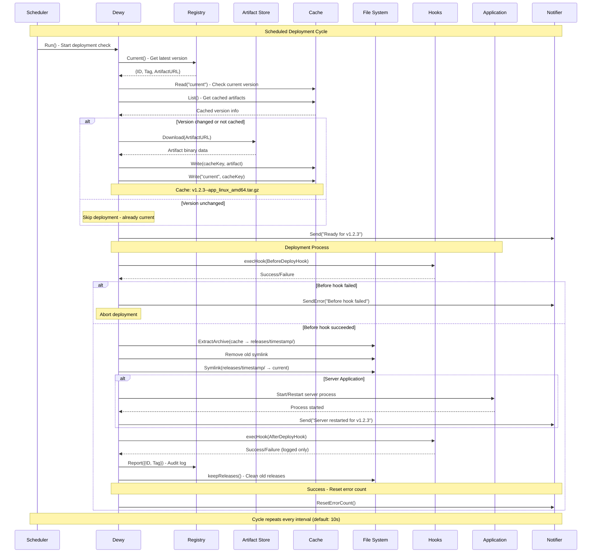

<p align="right">English | <a href="https://github.com/linyows/dewy/blob/main/README.ja.md">日本語</a></p>

<p align="center">
  <a href="https://dewy.linyo.ws">
    <br><br><br><br><br><br>
    <picture>
      <source media="(prefers-color-scheme: dark)" srcset="https://github.com/linyows/dewy/blob/main/misc/dewy-dark-bg.svg?raw=true">
      
    </picture>
    <br><br><br><br><br><br>
  </a>
</p>

<p align="center">
  <strong>Dewy</strong> enables declarative deployment of applications in non-Kubernetes environments.
</p>

<p align="center">
  <a href="https://github.com/linyows/dewy/actions/workflows/build.yml">
    
  </a>
  <a href="https://github.com/linyows/dewy/releases">
    
  </a>
  <a href="http://godoc.org/github.com/linyows/dewy">
    
  </a>
  <a href="https://deepwiki.com/linyows/dewy">
    
  </a>
</p>

Dewy is software primarily designed to declaratively deploy applications written in Go in non-container environments. Dewy acts as a supervisor for applications, running as the main process while launching the application as a child process. Its scheduler polls specified registries and, upon detecting the latest version (using semantic versioning), deploys from the designated artifact store. This enables Dewy to perform pull-based deployments. Dewy's architecture is composed of abstracted components: registries, artifact stores, cache stores, and notification channels. Below are diagrams illustrating Dewy's deployment process and architecture.

<p align="center">
  
</p>

Features
--

- Pull-based declaratively deployment
- Graceful restarts
- Configurable registries and artifact stores
- Deployment status notifications
- Audit logging

Usage
--

The following Server command demonstrates how to use GitHub Releases as a registry, start a server on port 8000, set the log level to `info` and enable notifications via Slack.

```sh
$ dewy server --registry ghr://linyows/myapp \
  --notifier slack://general?title=myapp -p 8000 -l info -- /opt/myapp/current/myapp
```

### Multi-Port Support

Dewy supports multiple port configurations for server applications:

```sh
# Multiple ports (comma-separated)
$ dewy server --registry ghr://linyows/myapp \
  -p 8000,8001,8002 -- /opt/myapp/current/myapp

# Port ranges
$ dewy server --registry ghr://linyows/myapp \
  -p 8000-8005 -- /opt/myapp/current/myapp
```

The registry and notification configurations are URL-like structures, where the scheme component represents the registry or notification type. More details are provided in the Registry section.

Commands
--

Dewy provides two main commands: `Server` and `Assets`. The `Server` command is designed for server applications, managing the application's processes and ensuring the application version stays up to date. The `Assets` command focuses on static files such as HTML, CSS, and JavaScript, keeping these assets updated to the latest version.

-	server
-	assets

Interfaces
--

Dewy provides several interfaces, each with multiple implementations to choose from. Below are brief descriptions of each. (Feel free to create an issue if there’s an implementation you’d like added.)

- Registry
- Artifact
- Cache
- Notifier

Registry
--

The Registry interface manages versions of applications and files. It currently supports GitHub Releases, AWS S3, Google Cloud Storage, and GRPC as sources.

### Common Options

There are two common options for the registry.

Option | Type | Description
---    | ---  | ---  
pre-release | bool | Set to true to include pre-release versions, following semantic versioning.
artifact | string | Specify the artifact filename if it does not follow the name_os_arch.ext pattern that Dewy matches by default.

> [!IMPORTANT]
> **Artifact Pattern Matching**: When the `artifact` option is not specified, Dewy automatically selects artifacts by matching the current OS and architecture in filenames. It performs case-insensitive substring matching for OS (`linux`, `darwin`/`macos`, `windows`) and architecture (`amd64`/`x86_64`, `arm64`, etc.). The first artifact containing both the current OS and architecture will be selected. If multiple artifacts match or if you need a specific artifact, use the `artifact` parameter to specify it explicitly.

### Github Releases

To use GitHub Releases as a registry, configure it as follows and set up the required environment variables for accessing the GitHub API.

```sh
# Format
# ghr://<owner-name>/<repo-name>?<options: pre-release, artifact>

# Example
$ export GITHUB_TOKEN=****.....
$ dewy --registry ghr://linyows/myapp?pre-release=true&artifact=dewy.tar ...
```

> [!NOTE]
> To prevent false alerts during CI/CD builds, Dewy automatically waits 30 minutes before reporting "artifact not found" errors for newly created releases. This grace period accommodates GitHub Actions and other CI systems that may take time to build and upload artifacts after creating a release.

### AWS S3

To use AWS S3 as a registry, configure it as follows. Options include specifying the region and endpoint (for S3-compatible services). Required AWS API credentials must also be set as environment variables.

```sh
# Format
# s3://<region-name>/<bucket-name>/<path-prefix>?<options: endpoint, pre-release, artifact>

# Example
$ export AWS_ACCESS_KEY_ID=****.....
$ export AWS_SECRET_ACCESS_KEY=****.....
$ dewy --registry s3://jp-north-1/dewy/foo/bar/myapp?endpoint=https://s3.isk01.sakurastorage.jp ...
```

Please ensure that the object path in S3 follows the order: `<prefix>/<semver>/<artifact>`. For example:

```sh
# <prefix>/<semver>/<artifact>
foo/bar/baz/v1.2.4-rc/dewy-testapp_linux_x86_64.tar.gz
                   /dewy-testapp_linux_arm64.tar.gz
                   /dewy-testapp_darwin_arm64.tar.gz
foo/bar/baz/v1.2.3/dewy-testapp_linux_x86_64.tar.gz
                  /dewy-testapp_linux_arm64.tar.gz
                  /dewy-testapp_darwin_arm64.tar.gz
foo/bar/baz/v1.2.2/dewy-testapp_linux_x86_64.tar.gz
                  /dewy-testapp_linux_arm64.tar.gz
                  /dewy-testapp_darwin_arm64.tar.gz
```

Dewy leverages aws-sdk-go-v2, so you can also specify region and endpoint through environment variables.

```sh
$ export AWS_ENDPOINT_URL="http://localhost:9000"
```

### Google Cloud Storage

To use Google Cloud Storage as a registry, configure it as follows. Required Google Cloud credentials must be set up through service account keys or other authentication methods supported by the Google Cloud SDK.

```sh
# Format
# gcs://<project-id>/<bucket-name>/<path-prefix>?<options: pre-release, artifact>

# Example
$ export GOOGLE_APPLICATION_CREDENTIALS="/path/to/service-account.json"
$ dewy --registry gcs://my-project/dewy-bucket/foo/bar/myapp ...
```

Please ensure that the object path in Google Cloud Storage follows the same order as S3: `<prefix>/<semver>/<artifact>`. For example:

```sh
# <prefix>/<semver>/<artifact>
foo/bar/baz/v1.2.4-rc/dewy-testapp_linux_x86_64.tar.gz
                   /dewy-testapp_linux_arm64.tar.gz
                   /dewy-testapp_darwin_arm64.tar.gz
foo/bar/baz/v1.2.3/dewy-testapp_linux_x86_64.tar.gz
                  /dewy-testapp_linux_arm64.tar.gz
                  /dewy-testapp_darwin_arm64.tar.gz
foo/bar/baz/v1.2.2/dewy-testapp_linux_x86_64.tar.gz
                  /dewy-testapp_linux_arm64.tar.gz
                  /dewy-testapp_darwin_arm64.tar.gz
```

Dewy uses the Google Cloud Storage Go client library, so authentication follows standard Google Cloud authentication methods including service account keys, workload identity, and default application credentials.

### GRPC

For using GRPC as a registry, configure as follows. Since the GRPC server defines artifact URLs, options like pre-release and artifact are not available. This registry is suitable if you wish to control artifact URLs or reporting dynamically.

```
# Format
# grpc://<server-host>?<options: no-tls>

# Example
$ dewy --registry grpc://localhost:9000?no-tls=true ...
```

Artifact
--

The Artifact interface manages application or file content itself. If the registry is not GRPC, artifacts will automatically align with the registry type. Supported types include GitHub Releases, AWS S3, and Google Cloud Storage.

Cache
--

The Cache interface stores the current versions and artifacts. Supported implementations include the file system, memory, HashiCorp Consul, and Redis.

Notifier
--

The Notifier interface sends deployment status updates. Slack and Mail (SMTP) are available as notification methods.

> [!WARNING]
> The `--notify` argument is deprecated and will be removed in a future version. Please use `--notifier` instead.

> [!IMPORTANT]
> **Error Notification Limiting**: Dewy automatically limits error notifications to prevent spam during persistent failures. After 3 error notifications, further notifications are suppressed until operations return to normal, at which point notification limiting is automatically reset.

### Slack

To use Slack for notifications, configure as follows. Options include a title and url that can link to the repository name or URL. You’ll need to [create a Slack App](https://api.slack.com/apps), generate an OAuth Token, and set the required environment variables. The app should have `channels:join` and `chat:write` permissions.

```sh
# Format
# slack://<channel-name>?<options: title, url>

# Example
$ export SLACK_TOKEN=****.....
$ dewy --notifier slack://dewy?title=myapp&url=https://dewy.liny.ws ...
```

### Mail

To use mail for notifications, configure as follows. You can specify SMTP settings through URL parameters or environment variables. For Gmail, you'll need to use app-specific passwords (2FA required) instead of your regular password.

```sh
# Format
# mail://<smtp-host>:<port>/<recipient-mail>?<options: username, password, from, subject, tls>
# smtp://<smtp-host>:<port>/<recipient-mail>?<options: username, password, from, subject, tls>

# Example with URL parameters
$ dewy --notifier mail://smtp.gmail.com:587/recipient@example.com?username=sender@gmail.com&password=app-password&from=sender@gmail.com&subject=Dewy+Deployment ...

# Example with environment variables
$ export MAIL_USERNAME=sender@gmail.com
$ export MAIL_PASSWORD=app-password
$ export MAIL_FROM=sender@gmail.com
$ dewy --notifier mail://smtp.gmail.com:587/recipient@example.com ...
```

#### Mail Configuration Options

Option   | Type   | Description                  | Default
---      | ---    | ---                          | ---
username | string | SMTP authentication username | (from MAIL_USERNAME env var)
password | string | SMTP authentication password | (from MAIL_PASSWORD env var)
from     | string | Sender mail address          | (from MAIL_FROM env var, or same as 'username' if not specified)
to       | string | Recipient mail address       | (extracted from URL path)
subject  | string | Mail subject line            | "Dewy Notification"
tls      | bool   | Use TLS encryption           | true
host     | string | SMTP server hostname         | (extracted from URL)
port     | int    | SMTP server port             | 587

Release Management
--

Dewy automatically manages releases in the local filesystem:

- **Release Storage**: Each deployment is stored in `releases/<timestamp>/` directory
- **Current Link**: A `current` symlink always points to the latest deployed version
- **Automatic Cleanup**: Only the 7 most recent releases are kept; older releases are automatically deleted
- **Directory Structure**:
  ```
  /opt/myapp/
  ├── current -> releases/20240315T143022Z/
  ├── releases/
  │   ├── 20240315T143022Z/    # Latest
  │   ├── 20240314T091534Z/
  │   ├── 20240313T172145Z/
  │   └── ...                  # Up to 7 releases total
  ```

Semantic Versioning
--

Dewy uses semantic versioning to determine the recency of artifact versions. Therefore, it's essential to manage software versions using semantic versioning.

```text
# Pre release versions：
v1.2.3-rc
v1.2.3-beta.2
```

For details, visit https://semver.org/

### Pre-release and Staging

Semantic versioning includes a concept called pre-release. A pre-release version is created by appending a suffix with a hyphen to the version number. In a staging environment, adding the option `pre-release=true` to the registry settings enables deployment of pre-release versions.

```sh
# Production environment (stable releases only)
$ dewy --registry ghr://linyows/myapp ...

# Staging environment (includes pre-release versions)
$ dewy --registry ghr://linyows/myapp?pre-release=true ...
```

Deployment Workflow
--

The following sequence diagram illustrates Dewy's deployment workflow from polling to server restart:



### Key Workflow Points

- **Polling**: Dewy continuously polls the registry at configurable intervals
- **Version Detection**: Uses semantic versioning to detect newer releases
- **Caching**: Downloads are cached to avoid repeated downloads
- **Atomic Deployment**: Old symlink is removed and new one created atomically
- **Hook Integration**: Before/after hooks can abort or customize deployment
- **Error Handling**: Failed deployments trigger error notifications (with limiting)
- **Audit Trail**: Successful deployments are reported back to registry

Deployment Hooks
--

Dewy supports deployment hooks that allow you to execute custom commands before and after deployments. These hooks are executed via shell (`/bin/sh -c`) in the working directory with full environment access.

### Hook Options

- `--before-deploy-hook`: Execute a command before deployment begins
- `--after-deploy-hook`: Execute a command after successful deployment

### Usage Examples

```sh
# Backup database before deployment
$ dewy server --registry ghr://myapp/api \
  --before-deploy-hook "pg_dump mydb > /backup/$(date +%Y%m%d_%H%M%S).sql" \
  --after-deploy-hook "echo 'Deployment completed' | mail -s 'Deploy Success' admin@example.com" \
  -- /opt/myapp/current/myapp

# Stop services before deployment and restart after
$ dewy server --registry ghr://myapp/api \
  --before-deploy-hook "systemctl stop nginx" \
  --after-deploy-hook "systemctl start nginx && systemctl reload nginx" \
  -- /opt/myapp/current/myapp

# Run database migrations after deployment
$ dewy assets --registry ghr://myapp/frontend \
  --after-deploy-hook "/opt/myapp/current/migrate-db.sh"
```

### Hook Behavior

- **Before Hook**: If the before-deploy-hook fails, the deployment is aborted
- **After Hook**: Executed only after successful deployment. If it fails, the deployment is still considered successful
- **Environment**: Hooks inherit all environment variables and run in the working directory
- **Logging**: All hook execution details (command, stdout, stderr) are logged

> [!TIP]
> **Common Use Cases**
> - **Database operations**: Backups, migrations, schema updates
> - **Service management**: Stopping/starting related services
> - **Cache management**: Clearing caches, warming up new deployments
> - **Notifications**: Custom alerting beyond built-in notifications
> - **Health checks**: Validating deployment success
> - **Configuration updates**: Dynamic configuration changes

Signal Handling
--

Dewy responds to various system signals for process management:

- **SIGHUP**: Ignored (Dewy continues operation)
- **SIGUSR1**: Triggers manual server restart
- **SIGINT, SIGTERM, SIGQUIT**: Initiates graceful shutdown
- **Internal SIGHUP**: Used internally for server restarts

### Manual Server Restart

You can manually restart the server application without restarting Dewy:

```sh
# Send SIGUSR1 to trigger server restart
$ kill -USR1 <dewy-pid>

# Or using systemctl if Dewy is managed by systemd
$ systemctl kill -s USR1 dewy.service
```


System Requirements
--

Dewy has minimal system requirements for deployment:

### File System Requirements

- **Write permissions**: Required in the working directory for release management
- **Symlink support**: File system must support symbolic links for the `current` pointer
- **Temporary directory**: Access to system temp directory for cache storage
- **Disk space**: Sufficient space for 7 releases plus cache (typically a few hundred MB)

### Process Requirements

- **Shell access**: `/bin/sh` must be available for hook execution
- **Network access**: Outbound connections to registries and artifact stores
- **Signal handling**: Process must be able to receive and handle system signals

> [!NOTE]
> Dewy runs as a single binary with no external dependencies beyond the Go runtime (which is compiled in).

Provisioning
--

Provisioning for Dewy is available via Chef and Puppet. Ansible support is not currently available—feel free to contribute if you're interested.

- Chef: https://github.com/linyows/dewy-cookbook
- Puppet: https://github.com/takumakume/puppet-dewy

Background
--

Go can compile code into a single binary tailored for each environment. In distributed systems with orchestrators like Kubernetes, deploying Go applications is typically straightforward. However, for single physical hosts or virtual machine environments without containers, there's no clear answer on how best to deploy a Go binary. Options range from writing shell scripts to use `scp` or `rsync` manually, to using server configuration tools like Ansible or even Ruby-based tools like Capistrano. However, when it comes to managing deployments across teams with audit and visibility into who deployed what, there seems to be a gap in tools that meet these specific needs.

Frequently Asked Questions
--

Here are some questions you may be asked:

- What happens if I delete the latest version from the registry?
    
    Dewy will adjust to the new latest version after deletion. While it’s generally not recommended to delete or overwrite released versions, there may be cases, such as security concerns, where deletion is unavoidable.
    
- Where can I find the audit logs?
    
    Audit logs are saved as text files at the location where the artifacts are hosted. Currently, there is no search functionality for these logs.
    If we identify a better solution, we may make adjustments. Additionally, it may be necessary to send notifications to observability tools like OTEL for enhanced monitoring, separate from the audit logs.
    
- How can I prevent registry rate limits caused by polling from multiple Dewy instances?
    
    By using a cache component like HashiCorp Consul or Redis, you can share the cache among multiple Dewy instances, which reduces the total number of requests to the registry. In this case, it's best to set an appropriate registry TTL.
    You can also extend the polling interval by specifying it in the command options.

Author
--

[@linyows](https://github.com/linyows)
