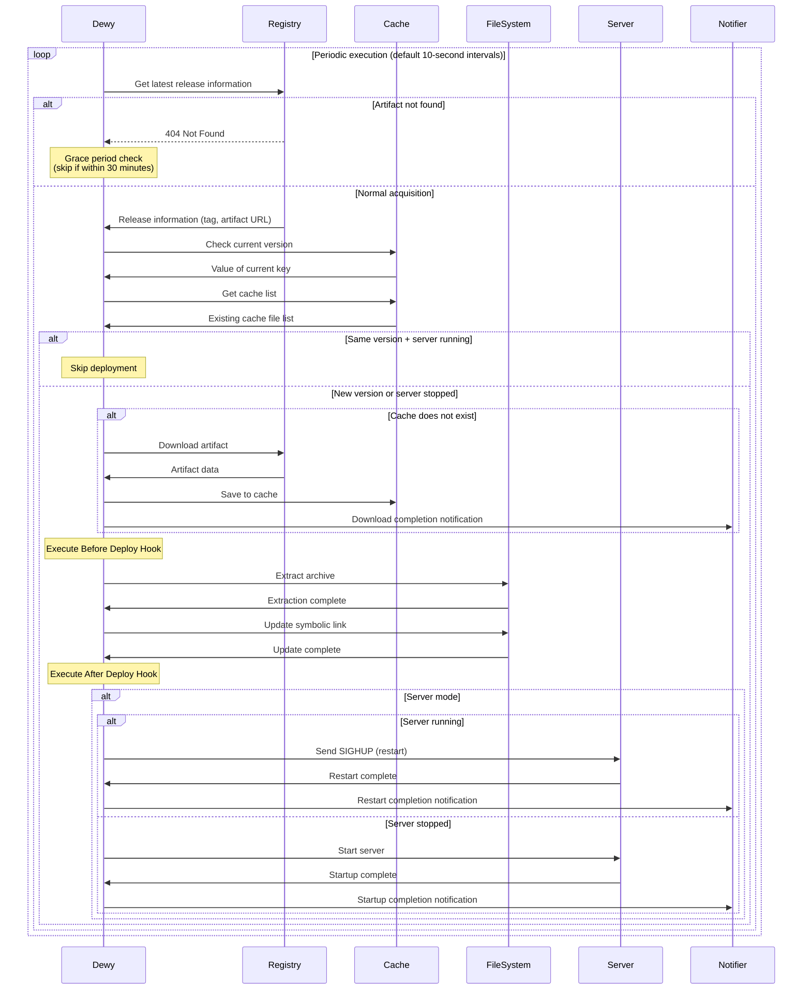

#  

Dewy achieves continuous application delivery through an automated deployment workflow. It periodically monitors registries and automatically executes download, extraction, and deployment when new releases are detected. This process is fully automated, maintaining the latest version of applications in running state without manual operations.

## Deployment Workflow Overview

Dewy's deployment workflow consists of five major phases that work together to achieve safe and efficient deployment.

The deployment workflow executes repeatedly at configured intervals (default 10 seconds) to maintain the latest state at all times. First, **periodic checks** monitor the registry to detect new releases. Next, **version comparison** compares with the currently running version to determine if updates are needed. When updates are required, **artifact download** retrieves binaries, **deployment execution** extracts applications, and finally **application control** manages server startup and restart.

Each phase includes appropriate error handling and notifications, automatically reporting to administrators when problems occur. Optimizations to avoid unnecessary processing are also built in for efficient system resource usage.

## Detailed Processing by Phase

Each phase of the deployment workflow executes processing with specific responsibilities, ensuring safe and reliable deployment. The following sequence diagram shows dewy's typical deployment workflow.



### Check Phase

In the check phase, the latest release information is retrieved from the configured registry. Communication is performed according to the configured registry type such as GitHub Releases, S3, Google Cloud Storage, collecting available latest version information.

This phase implements an important feature called **grace period**. When artifacts are not found within 30 minutes of release creation, processing is skipped without treating it as an error. This enables operations that consider the time required for CI/CD systems to complete artifact builds and uploads after creating releases.

```bash
# Skip log example during grace period
DEBUG: Artifact not found within grace period message="artifact not found" grace_period=30m0s
```

### Cache Phase

In the cache phase, local cache status is verified based on retrieved release information. When artifacts of the same version are already cached, download processing is skipped for efficiency.

Currently running version information is managed with the `current` key and compared with the new version's cache key (`tag--artifact` format). When versions are identical and the server is operating normally, all subsequent processing is skipped.

```bash
# Log example when deployment is skipped
DEBUG: Deploy skipped
```

However, if application startup fails in server mode, deployment processing continues even when cache exists. This provides an opportunity to automatically repair application problems.

### Download Phase

In the download phase, new version artifacts are downloaded from the registry and saved to local cache. Downloads are executed using optimized methods according to the configured registry type.

Downloaded artifacts are first saved to memory buffers and persisted as cache files only after download is completely finished. This method prevents generation of corrupted files due to interruption during download.

```bash
# Log example when download completes
INFO: Cached artifact cache_key="v1.2.3--myapp_linux_amd64.tar.gz"
INFO: Download notification message="Downloaded artifact for v1.2.3"
```

After download completion, completion reports are sent to administrators and teams through the notification system.

### Deploy Phase

In the deploy phase, cached artifacts are extracted and placed in the application directory. This phase is the most critical stage, consisting of multiple sub-steps.

First, **Before Deploy Hook** is executed if configured. This hook enables automation of necessary preparation work before deployment (database migration, service stops, etc.). Even if hooks fail, deployment continues, but failures are recorded and notified.

Next, artifacts are extracted to directories in `releases/YYYYMMDDTHHMMSSZ` format. Extraction processing supports major archive formats such as tar.gz, zip, tar.bz2, and properly preserves file permissions.

```bash
# Deploy processing log example
INFO: Extract archive path="/opt/app/releases/20240115T103045Z"
INFO: Create symlink from="/opt/app/releases/20240115T103045Z" to="/opt/app/current"
```

After extraction completion, the `current` symbolic link is updated to point to the new release directory. Existing symbolic links are removed beforehand, ensuring atomic switching.

Finally, **After Deploy Hook** is executed if configured. This hook enables automation of post-deployment processing (cache clearing, notification sending, service resumption, etc.).

### Startup Control Phase

In the startup control phase, application startup state is managed when operating in server mode. In assets mode, this processing is skipped since only file placement is the objective.

When a server is already running, **server restart** processing is executed. Dewy sends a SIGHUP signal to its own process and executes a graceful restart through the server-starter library. This method enables switching to new versions while minimizing impact on connected clients.

```bash
# Log example during server restart
INFO: Send SIGHUP for server restart pid=12345
INFO: Restart notification message="Server restarted for v1.2.3"
```

When the server is not running, **server startup** processing is executed. Application processes are started using server-starter and listening on configured ports begins.

After startup/restart processing completion, results are reported through the notification system, enabling operations teams to understand the situation.

## Deployment Skip Conditions

Dewy includes functionality to automatically skip unnecessary deployment processing for efficient operation. This achieves system resource conservation and stable operation.

### Avoiding Duplicate Deployments with Same Version

The most basic skip condition is when the currently running version and newly checked version are identical. Duplicate processing of the same artifact is prevented through current version information and cache existence verification.

This determination is made by comparing the value stored in the `current` key with the cache key generated from the new release. When they match completely, all subsequent processing is skipped and a "Deploy skipped" log is output.

### Determination Based on Server Execution State

During server mode operation, application execution state is also considered. When versions are identical and the server is running normally, processing is skipped to maintain the current state.

However, when server startup failure is detected, deployment processing executes even with identical versions. This provides an opportunity to automatically repair startup failures due to configuration changes or resource problems.

### Always Skip in Assets Mode

When operating in assets mode, processing is always skipped for identical versions. Since the main purpose is static file placement, it is determined that redeployment is unnecessary for the same version regardless of server execution state.

```bash
# Skip example in assets mode
# Always return nil for identical versions
```

This behavior eliminates wasteful processing in static file delivery for CDNs and web servers.

## Error Handling

Dewy's deployment workflow incorporates comprehensive error handling functionality to respond to various failure situations. Appropriate responses and continuity assurance are provided for problems that may occur at each stage.

### Grace Period for Artifact Not Found

Considering CI/CD system characteristics, a grace period is applied for artifact not found immediately after release creation. Within 30 minutes of release tag creation, missing artifacts are not treated as errors.

This functionality ensures temporal allowance from release creation by GitHub Actions or other CI/CD systems until build process completion and artifact upload. Warning logs are output during the grace period, but alert notifications are not sent.

```go
// 30-minute grace period configuration
gracePeriod := 30 * time.Minute
if artifactNotFoundErr.IsWithinGracePeriod(gracePeriod) {
    // Avoid error notification and return nil
    return nil
}
```

When the grace period is exceeded, it is processed as a normal error and notifications are sent to administrators.

### Continued Processing During Deploy Hook Failures

Even when Before Deploy Hook or After Deploy Hook execution fails, deployment processing itself continues. This design prevents auxiliary processing failures from blocking main deployment.

Hook failures are logged in detail and reported to administrators through the notification system. Administrators can check failure details and manually address them as needed.

```bash
# Log example during hook failure
ERROR: Before deploy hook failure error="command failed with exit code 1"
```

Deployment continues even after Before Deploy Hook failure, and After Deploy Hook is also executed. This behavior enables completing system updates as much as possible even with partial failures.

### Error Processing and Notification in Each Phase

Errors occurring in each phase are appropriately categorized by type and corresponding notifications are sent. Specialized error messages and logs are generated for registry access errors, download failures, extraction errors, server startup failures, etc.

When critical errors occur, subsequent processing is aborted and the system maintains the previous state. This prevents service interruption due to incomplete deployments. For temporary errors, automatic retry occurs in the next periodic check cycle.

Error information is recorded as structured logs and can be utilized for automatic analysis in monitoring systems or detailed investigation by administrators.

## Notification and Logging

Dewy provides comprehensive notification and logging functionality to visualize the entire deployment process and enable operations teams to accurately understand the situation.

### Deployment Start, Completion, and Failure Notifications

At important deployment milestones, messages are automatically sent to configured notification channels (Slack, email, etc.). At deployment start, target versions and processing content are notified, and at completion, successful versions and execution times are reported.

```bash
# Notification message examples
"Downloaded artifact for v1.2.3"
"Server restarted for v1.2.3"
"Automatic shipping started by Dewy (v1.0.0: server)"
```

During failures, notifications containing detailed error information and recommended countermeasures are sent. This enables operations teams to quickly recognize problems and start appropriate responses.

### Hook Execution Result Notifications

Before Deploy Hook and After Deploy Hook execution results are notified with detailed execution information. For success, execution time and output content are reported; for failure, exit codes and error messages are reported.

```bash
# Hook execution result examples
INFO: Execute hook command="npm run build" stdout="Build completed" duration="45.2s"
ERROR: After deploy hook failure error="Migration failed" exit_code=1
```

This information enables detailed tracking of each step in automated deployment processes, helping with early problem detection and resolution.

### Detailed Log Output at Each Stage

Dewy uses structured logging to record detailed information at each stage of the deployment workflow. According to log levels, information can be collected at necessary granularity from debug information to important events.

Major log entries include timestamps, log levels, messages, and related metadata (versions, cache keys, process IDs, etc.). This enables rapid identification of necessary information during problem investigation.

```json
{"time":"2024-01-15T10:30:45Z","level":"INFO","msg":"Dewy started","version":"v1.0.0","commit":"abc1234"}
{"time":"2024-01-15T10:30:46Z","level":"INFO","msg":"Cached artifact","cache_key":"v1.2.3--myapp_linux_amd64.tar.gz"}
{"time":"2024-01-15T10:30:47Z","level":"DEBUG","msg":"Deploy skipped"}
```

Log information is utilized for real-time monitoring, trend analysis, performance optimization, and satisfying audit requirements, forming an important foundation for dewy operations.