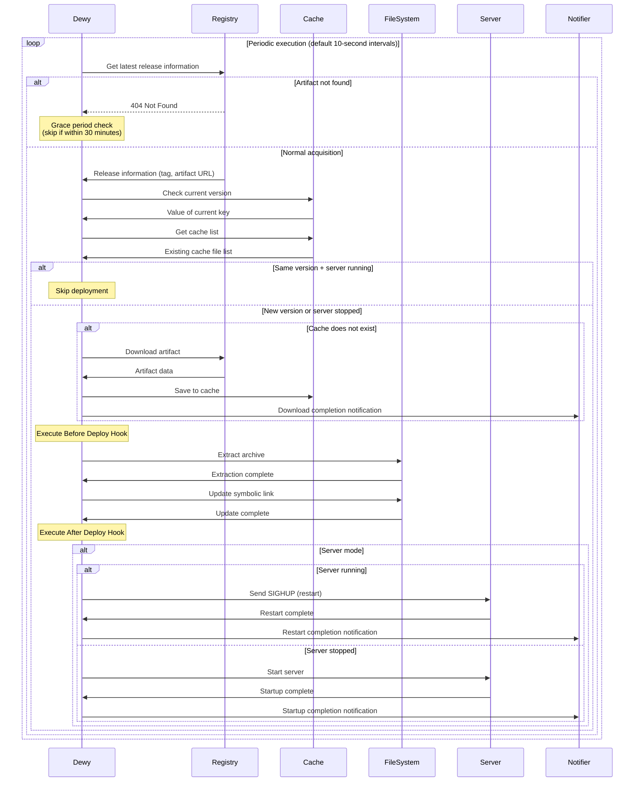
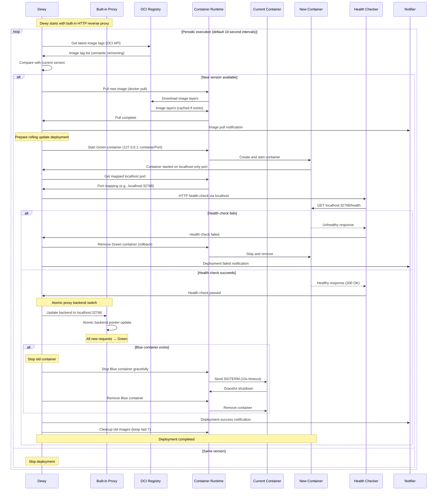
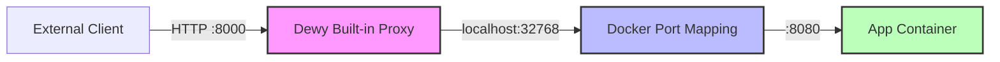
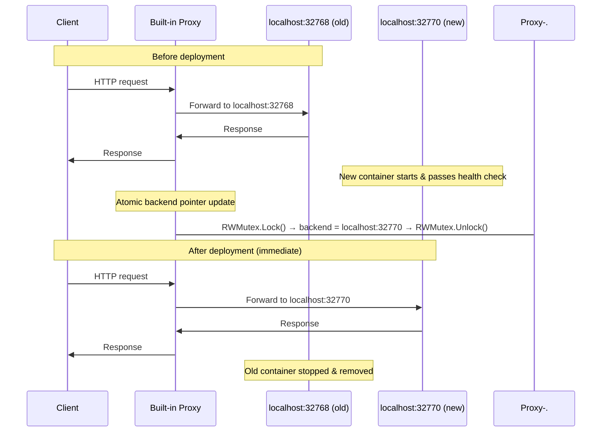
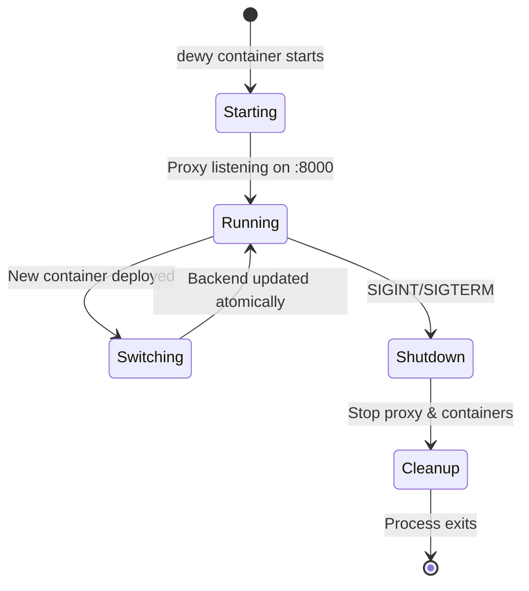
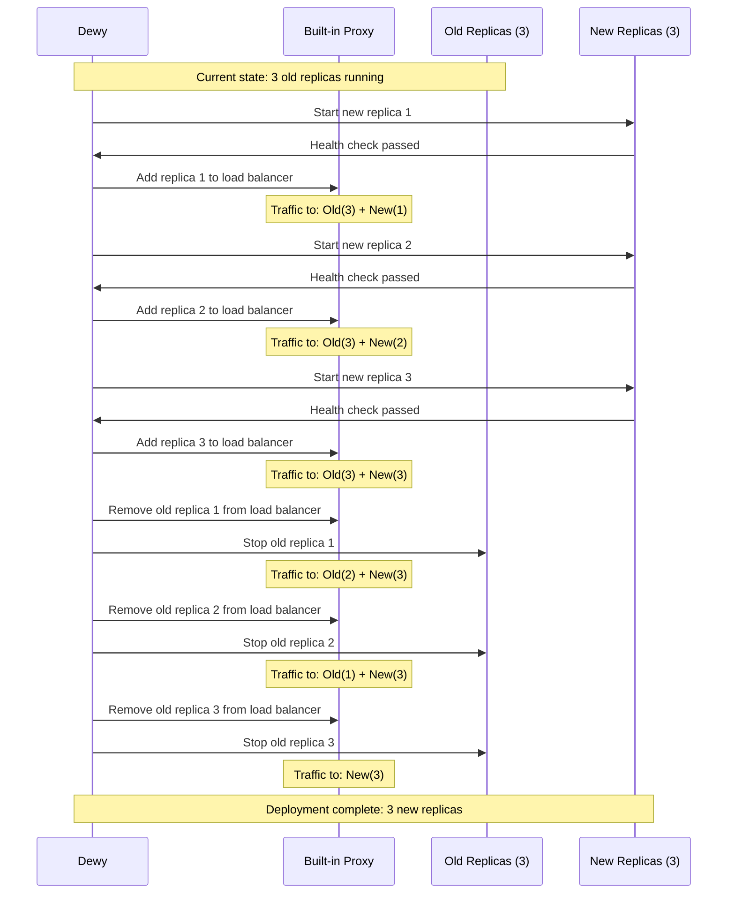

#  

Dewy achieves continuous application delivery through an automated deployment workflow. It periodically monitors registries and automatically executes download, extraction, and deployment when new releases are detected. This process is fully automated, maintaining the latest version of applications in running state without manual operations.

## Deployment Workflow Overview

Dewy's deployment workflow consists of five major phases that work together to achieve safe and efficient deployment.

The deployment workflow executes repeatedly at configured intervals (default 10 seconds) to maintain the latest state at all times. First, **periodic checks** monitor the registry to detect new releases. Next, **version comparison** compares with the currently running version to determine if updates are needed. When updates are required, **artifact download** retrieves binaries, **deployment execution** extracts applications, and finally **application control** manages server startup and restart.

Each phase includes appropriate error handling and notifications, automatically reporting to administrators when problems occur. Optimizations to avoid unnecessary processing are also built in for efficient system resource usage.

## Detailed Processing by Phase

Each phase of the deployment workflow executes processing with specific responsibilities, ensuring safe and reliable deployment. The following sequence diagram shows dewy's typical deployment workflow.



### Check Phase

In the check phase, the latest release information is retrieved from the configured registry. Communication is performed according to the configured registry type such as GitHub Releases, S3, Google Cloud Storage, collecting available latest version information.

This phase implements an important feature called **grace period**. When artifacts are not found within 30 minutes of release creation, processing is skipped without treating it as an error. This enables operations that consider the time required for CI/CD systems to complete artifact builds and uploads after creating releases.

```bash
# Skip log example during grace period
DEBUG: Artifact not found within grace period message="artifact not found" grace_period=30m0s
```

### Cache Phase

In the cache phase, local cache status is verified based on retrieved release information. When artifacts of the same version are already cached, download processing is skipped for efficiency.

Currently running version information is managed with the `current` key and compared with the new version's cache key (`tag--artifact` format). When versions are identical and the server is operating normally, all subsequent processing is skipped.

```bash
# Log example when deployment is skipped
DEBUG: Deploy skipped
```

However, if application startup fails in server mode, deployment processing continues even when cache exists. This provides an opportunity to automatically repair application problems.

### Download Phase

In the download phase, new version artifacts are downloaded from the registry and saved to local cache. Downloads are executed using optimized methods according to the configured registry type.

Downloaded artifacts are first saved to memory buffers and persisted as cache files only after download is completely finished. This method prevents generation of corrupted files due to interruption during download.

```bash
# Log example when download completes
INFO: Cached artifact cache_key="v1.2.3--myapp_linux_amd64.tar.gz"
INFO: Download notification message="Downloaded artifact for v1.2.3"
```

After download completion, completion reports are sent to administrators and teams through the notification system.

### Deploy Phase

In the deploy phase, cached artifacts are extracted and placed in the application directory. This phase is the most critical stage, consisting of multiple sub-steps.

First, **Before Deploy Hook** is executed if configured. This hook enables automation of necessary preparation work before deployment (database migration, service stops, etc.). Even if hooks fail, deployment continues, but failures are recorded and notified.

Next, artifacts are extracted to directories in `releases/YYYYMMDDTHHMMSSZ` format. Extraction processing supports major archive formats such as tar.gz, zip, tar.bz2, and properly preserves file permissions.

```bash
# Deploy processing log example
INFO: Extract archive path="/opt/app/releases/20240115T103045Z"
INFO: Create symlink from="/opt/app/releases/20240115T103045Z" to="/opt/app/current"
```

After extraction completion, the `current` symbolic link is updated to point to the new release directory. Existing symbolic links are removed beforehand, ensuring atomic switching.

Finally, **After Deploy Hook** is executed if configured. This hook enables automation of post-deployment processing (cache clearing, notification sending, service resumption, etc.).

### Startup Control Phase

In the startup control phase, application startup state is managed when operating in server mode. In assets mode, this processing is skipped since only file placement is the objective.

When a server is already running, **server restart** processing is executed. Dewy sends a SIGHUP signal to its own process and executes a graceful restart through the server-starter library. This method enables switching to new versions while minimizing impact on connected clients.

```bash
# Log example during server restart
INFO: Send SIGHUP for server restart pid=12345
INFO: Restart notification message="Server restarted for v1.2.3"
```

When the server is not running, **server startup** processing is executed. Application processes are started using server-starter and listening on configured ports begins.

After startup/restart processing completion, results are reported through the notification system, enabling operations teams to understand the situation.

## Deployment Skip Conditions

Dewy includes functionality to automatically skip unnecessary deployment processing for efficient operation. This achieves system resource conservation and stable operation.

### Avoiding Duplicate Deployments with Same Version

The most basic skip condition is when the currently running version and newly checked version are identical. Duplicate processing of the same artifact is prevented through current version information and cache existence verification.

This determination is made by comparing the value stored in the `current` key with the cache key generated from the new release. When they match completely, all subsequent processing is skipped and a "Deploy skipped" log is output.

### Determination Based on Server Execution State

During server mode operation, application execution state is also considered. When versions are identical and the server is running normally, processing is skipped to maintain the current state.

However, when server startup failure is detected, deployment processing executes even with identical versions. This provides an opportunity to automatically repair startup failures due to configuration changes or resource problems.

### Always Skip in Assets Mode

When operating in assets mode, processing is always skipped for identical versions. Since the main purpose is static file placement, it is determined that redeployment is unnecessary for the same version regardless of server execution state.

```bash
# Skip example in assets mode
# Always return nil for identical versions
```

This behavior eliminates wasteful processing in static file delivery for CDNs and web servers.

## Error Handling

Dewy's deployment workflow incorporates comprehensive error handling functionality to respond to various failure situations. Appropriate responses and continuity assurance are provided for problems that may occur at each stage.

### Grace Period for Artifact Not Found

Considering CI/CD system characteristics, a grace period is applied for artifact not found immediately after release creation. Within 30 minutes of release tag creation, missing artifacts are not treated as errors.

This functionality ensures temporal allowance from release creation by GitHub Actions or other CI/CD systems until build process completion and artifact upload. Warning logs are output during the grace period, but alert notifications are not sent.

```go
// 30-minute grace period configuration
gracePeriod := 30 * time.Minute
if artifactNotFoundErr.IsWithinGracePeriod(gracePeriod) {
    // Avoid error notification and return nil
    return nil
}
```

When the grace period is exceeded, it is processed as a normal error and notifications are sent to administrators.

### Continued Processing During Deploy Hook Failures

Even when Before Deploy Hook or After Deploy Hook execution fails, deployment processing itself continues. This design prevents auxiliary processing failures from blocking main deployment.

Hook failures are logged in detail and reported to administrators through the notification system. Administrators can check failure details and manually address them as needed.

```bash
# Log example during hook failure
ERROR: Before deploy hook failure error="command failed with exit code 1"
```

Deployment continues even after Before Deploy Hook failure, and After Deploy Hook is also executed. This behavior enables completing system updates as much as possible even with partial failures.

### Error Processing and Notification in Each Phase

Errors occurring in each phase are appropriately categorized by type and corresponding notifications are sent. Specialized error messages and logs are generated for registry access errors, download failures, extraction errors, server startup failures, etc.

When critical errors occur, subsequent processing is aborted and the system maintains the previous state. This prevents service interruption due to incomplete deployments. For temporary errors, automatic retry occurs in the next periodic check cycle.

Error information is recorded as structured logs and can be utilized for automatic analysis in monitoring systems or detailed investigation by administrators.

## Notification and Logging

Dewy provides comprehensive notification and logging functionality to visualize the entire deployment process and enable operations teams to accurately understand the situation.

### Deployment Start, Completion, and Failure Notifications

At important deployment milestones, messages are automatically sent to configured notification channels (Slack, email, etc.). At deployment start, target versions and processing content are notified, and at completion, successful versions and execution times are reported.

```bash
# Notification message examples
"Downloaded artifact for v1.2.3"
"Server restarted for v1.2.3"
"Automatic shipping started by Dewy (v1.0.0: server)"
```

During failures, notifications containing detailed error information and recommended countermeasures are sent. This enables operations teams to quickly recognize problems and start appropriate responses.

### Hook Execution Result Notifications

Before Deploy Hook and After Deploy Hook execution results are notified with detailed execution information. For success, execution time and output content are reported; for failure, exit codes and error messages are reported.

```bash
# Hook execution result examples
INFO: Execute hook command="npm run build" stdout="Build completed" duration="45.2s"
ERROR: After deploy hook failure error="Migration failed" exit_code=1
```

This information enables detailed tracking of each step in automated deployment processes, helping with early problem detection and resolution.

### Detailed Log Output at Each Stage

Dewy uses structured logging to record detailed information at each stage of the deployment workflow. According to log levels, information can be collected at necessary granularity from debug information to important events.

Major log entries include timestamps, log levels, messages, and related metadata (versions, cache keys, process IDs, etc.). This enables rapid identification of necessary information during problem investigation.

```json
{"time":"2024-01-15T10:30:45Z","level":"INFO","msg":"Dewy started","version":"v1.0.0","commit":"abc1234"}
{"time":"2024-01-15T10:30:46Z","level":"INFO","msg":"Cached artifact","cache_key":"v1.2.3--myapp_linux_amd64.tar.gz"}
{"time":"2024-01-15T10:30:47Z","level":"DEBUG","msg":"Deploy skipped"}
```

Log information is utilized for real-time monitoring, trend analysis, performance optimization, and satisfying audit requirements, forming an important foundation for dewy operations.

## Container Deployment Workflow

When operating in container mode (`dewy container`), the deployment workflow differs significantly from binary deployments. Container deployments use a rolling update strategy with localhost-only port mapping and a built-in reverse proxy to achieve zero-downtime updates.

### Container Deployment Sequence

The following sequence diagram shows the container deployment workflow using localhost-only port mapping and built-in reverse proxy:



### Container Deployment Phases

#### 1. Image Check Phase

In the container deployment workflow, the check phase queries the OCI/Docker registry using the Distribution API (v2). Unlike binary deployments that check GitHub Releases or S3, container deployments:

- Fetch image tags using `GET /v2/<name>/tags/list`
- Filter tags using Semantic Versioning rules
- Support pre-release tags with query parameters
- Authenticate using Docker config.json or environment variables

```bash
# Example registry URLs
img://ghcr.io/linyows/myapp
img://us-central1-docker.pkg.dev/project-id/myapp-repo/myapp
img://docker.io/library/nginx
```

#### 2. Image Pull Phase

When a new version is detected, dewy instructs the container runtime to pull the image:

```bash
# Log example during image pull
INFO: Pulling new image image="ghcr.io/linyows/myapp:v1.2.3"
INFO: Image pull complete digest="sha256:abc123..."
INFO: Image pull notification message="Pulled image v1.2.3"
```

Container images are composed of multiple layers, which are cached by the container runtime. Only changed layers are downloaded, significantly reducing deployment time for incremental updates.

#### 3. Rolling Update Deployment Phase

Container deployments use a rolling update strategy with localhost-only port mapping and built-in reverse proxy for zero-downtime updates. This phase consists of several critical steps:

**Step 1: Start Green Container with Localhost-Only Port**

The new version container (Green) is started with localhost-only port mapping (`127.0.0.1::containerPort`):

```bash
# Log example
INFO: Starting new container name="myapp-1234567890" image="myapp:v1.2.3"
INFO: Adding localhost-only port mapping mapping="127.0.0.1::8080"
INFO: Container port mapped container_port=8080 host_port=32768
```

The `127.0.0.1::8080` format ensures the container is only accessible from localhost, not from external networks, improving security.

**Step 2: Health Check via Localhost**

Dewy performs health checks against the Green container using the mapped localhost port:

```bash
# HTTP health check via localhost
INFO: Health checking new container url="http://localhost:32768/health"
INFO: Health check passed status=200 duration="50ms"
```

If health checks fail, the Green container is immediately removed (rollback), and the current container continues serving traffic.

**Step 3: Atomic Proxy Backend Switch**

Once health checks pass, dewy performs atomic traffic switching by updating the built-in reverse proxy backend:

```bash
# Atomic backend pointer update
INFO: Updating proxy backend to localhost:32768
INFO: Proxy backend updated backend="http://localhost:32768"
```

This operation uses Go's `sync.RWMutex` for atomic pointer updates. New HTTP requests immediately route to the Green container through the updated proxy backend.

**Step 4: Old Container Removal**

After traffic switching, the old container is immediately stopped and removed:

```bash
# Stop old container (10-second grace period)
INFO: Stopping old container container="myapp-1234567880"
INFO: Managed container stopped container="myapp-1234567880"
INFO: Managed container removed container="myapp-1234567880"
```

There is no drain period needed because the proxy switch is atomic - the old container is stopped immediately after the proxy backend is updated.

**Step 5: Image Cleanup**

Finally, old container images are automatically cleaned up (keeping the last 7 versions):

```bash
INFO: Keep images count=7
INFO: Removing old image id="sha256:abc123..." tag="v1.2.1"
```

### Container Deployment vs Binary Deployment

Key differences between container and binary deployment workflows:

| Aspect | Binary Deployment | Container Deployment |
|--------|------------------|---------------------|
| **Artifact Source** | GitHub Releases, S3, GCS | OCI Registry (Docker Hub, GHCR, etc.) |
| **Artifact Format** | tar.gz, zip archives | OCI Image (multi-layer) |
| **Deployment Strategy** | In-place update + SIGHUP | Rolling update with proxy |
| **Downtime** | Minimal (restart time) | Zero (atomic proxy switch) |
| **Rollback** | Previous release directory | Automatic on health check failure |
| **Health Check** | Process-based | HTTP/TCP via localhost |
| **Traffic Management** | server-starter (port handoff) | Built-in reverse proxy |
| **Network Security** | N/A | Localhost-only (127.0.0.1) |

### Network Architecture

Container deployments use localhost-only port mapping with built-in reverse proxy:

```
[External Client]
       ↓
   [Dewy Built-in Proxy :8000]  ← --port 8000 (external access)
       ↓ atomic backend switch
   [localhost:32768]  ← Docker port mapping (127.0.0.1::8080)
       ↓
   [Container:8080]  ← App container (--container-port 8080)
```

Key security features:
- Containers bind to `127.0.0.1` only (not accessible from external network)
- Built-in proxy handles all external traffic
- Atomic backend switching ensures zero-downtime deployments

### Container Deployment Error Handling

Container deployments include specific error handling mechanisms:

#### Health Check Failures

When Green container health checks fail, automatic rollback occurs:

```bash
ERROR: Health check failed error="connection refused" attempts=5
INFO: Rolling back deployment
INFO: Removing failed container container="myapp-green-1234567890"
```

The Blue container remains operational, ensuring service continuity.

#### Image Pull Failures

If image pulling fails due to network issues or authentication problems:

```bash
ERROR: Image pull failed error="authentication required" image="ghcr.io/linyows/myapp:v1.2.3"
```

The system retries on the next polling interval. The current container continues running unchanged.

#### Container Startup Failures

If the Green container fails to start (invalid configuration, missing dependencies):

```bash
ERROR: Container start failed error="port already in use: 8080"
INFO: Removing failed container
```

Dewy removes the failed container and maintains the current version in production.

### Container Deployment Notifications

Container-specific notifications include additional information:

```bash
# Pull notification
"Pulled image for v1.2.3"

# Deployment phases
INFO: Starting container name="myapp-1234567890" image="ghcr.io/linyows/myapp:v1.2.3"
INFO: Container port mapped container_port=8080 host_port=32768
INFO: Health check passed url="http://localhost:32768/health" status=200

# Proxy backend switch
INFO: Proxy backend updated backend="http://localhost:32768"

# Cleanup
INFO: Stopping old container container="myapp-1234567880"
INFO: Keep images count=7
INFO: Removing old image id="sha256:abc123..." tag="v1.2.1"

# Deployment complete
"Container deployed successfully for v1.2.3"
```

These notifications provide detailed visibility into the container deployment process, enabling operations teams to track deployment progress and diagnose issues quickly.

## Built-in Reverse Proxy

Dewy includes a built-in HTTP reverse proxy for container deployments. The proxy automatically starts when using `dewy container` and handles all external traffic, providing zero-downtime deployments through atomic backend switching.

### Proxy Architecture



Key components:

- **Dewy Built-in Proxy**: Go HTTP reverse proxy running inside the dewy process, listens on external port (e.g., :8000)
- **Localhost Port Mapping**: Docker maps container port to a random localhost port (127.0.0.1:32768)
- **Atomic Backend Switch**: Uses `sync.RWMutex` to atomically update the proxy backend during deployments
- **App Container**: Application container accessible only via localhost, not from external network

### How It Works

The built-in reverse proxy is automatically enabled when you run `dewy container`. Here's how it operates:

#### 1. Proxy Initialization

When dewy starts, the built-in HTTP reverse proxy initializes:

```bash
INFO: Starting built-in reverse proxy port=8000
INFO: Reverse proxy started successfully external_port=8000
```

The proxy runs in a goroutine within the dewy process and listens on the port specified by `--port` (default: 8000).

#### 2. Container Deployment with Localhost-Only Port

Containers are started with localhost-only port mapping for security:

```bash
# Docker run command executed by dewy
docker run -d \
  --name myapp-1234567890 \
  -p 127.0.0.1::8080 \
  --label dewy.managed=true \
  --label dewy.app=myapp \
  ghcr.io/linyows/myapp:v1.2.3

# Docker assigns random localhost port (e.g., 127.0.0.1:32768)
INFO: Container started container=abc123... mapped_port=32768
```

The container port is only accessible via localhost, not from the external network. This provides an additional security layer.

#### 3. Atomic Backend Switch

During rolling update deployment, the proxy atomically switches its backend to the new container:



The backend switch is atomic and instantaneous - no requests are lost during the transition. The proxy uses Go's `sync.RWMutex` to ensure thread-safe updates.

#### 4. Cleanup on Shutdown

When dewy receives `SIGINT`, `SIGTERM`, or `SIGQUIT`, it automatically cleans up all managed containers:

```bash
INFO: Shutting down gracefully
INFO: Stopping reverse proxy
INFO: Cleaning up managed containers
INFO: Stopping managed container container=myapp-1234567890
INFO: Removing managed container container=myapp-1234567890
INFO: Cleanup completed containers_cleaned=1
```

All containers labeled with `dewy.managed=true` are stopped and removed. The built-in proxy stops gracefully along with the dewy process.

### Proxy Lifecycle



### Use Cases

The built-in reverse proxy provides several benefits:

1. **Zero-Downtime Deployments**: Atomic backend switching ensures no requests are dropped during deployment
2. **Security**: Containers are only accessible via localhost (127.0.0.1), not from external network
3. **Simple Configuration**: No external proxy containers or Docker networks required
4. **Single Entry Point**: All external traffic goes through one port, simplifying firewall rules
5. **Automatic Port Management**: Docker assigns random localhost ports, avoiding port conflicts

### Technical Details

Implementation details of the built-in proxy:

- **Proxy Type**: `net/http/httputil.ReverseProxy` (Go standard library)
- **Concurrency**: Thread-safe backend updates using `sync.RWMutex`
- **Health Checks**: HTTP health checks via localhost before switching backends
- **Error Handling**: Automatic rollback if health checks fail
- **Performance**: In-process proxy eliminates container-to-container network overhead
- **Load Balancing**: Round-robin distribution for multiple container replicas

## Multiple Container Replicas

Dewy supports running multiple container replicas for improved availability and load distribution. The built-in reverse proxy automatically load balances requests across all healthy replicas using a round-robin algorithm.

### Load Balancing

When multiple replicas are configured, the reverse proxy distributes incoming requests evenly:

```
Request 1 → Container 1 (localhost:32768)
Request 2 → Container 2 (localhost:32770)
Request 3 → Container 3 (localhost:32772)
Request 4 → Container 1 (localhost:32768)  # Round-robin
...
```

**Key Features:**
- Round-robin load balancing for even traffic distribution
- Each container runs on its own localhost port
- Automatic health checks for all replicas
- Failed containers are automatically excluded from rotation

### Rolling Update Deployment

When deploying new versions with multiple replicas, Dewy performs a gradual rolling update:



**Rolling Update Process:**
1. Start new replicas one at a time
2. Health check each new replica
3. Add healthy replicas to load balancer
4. After all new replicas are running, remove old replicas one by one
5. Gradual transition ensures continuous availability

**Benefits:**
- Zero downtime during updates
- Automatic rollback if health checks fail
- Always maintains capacity during deployment
- Safe gradual rollout reduces risk

### Example: Multiple Replicas

```bash
# Run with 3 replicas for high availability
dewy container \
  --registry "img://ghcr.io/linyows/myapp?pre-release=true" \
  --container-port 8080 \
  --replicas 3 \
  --health-path /health \
  --health-timeout 30 \
  --port 8000 \
  --log-level info

# Output shows rolling deployment:
# INFO: Starting container deployment replicas=3
# INFO: Pulling new image image=ghcr.io/linyows/myapp:v1.2.3
# INFO: Found existing containers count=0
# INFO: Starting new container replica=1 total=3
# INFO: Container started container=abc123... mapped_port=32768
# INFO: Health check passed url=http://localhost:32768/health
# INFO: Container added to load balancer backend_count=1
# INFO: Starting new container replica=2 total=3
# INFO: Container started container=def456... mapped_port=32770
# INFO: Health check passed url=http://localhost:32770/health
# INFO: Container added to load balancer backend_count=2
# INFO: Starting new container replica=3 total=3
# INFO: Container started container=ghi789... mapped_port=32772
# INFO: Health check passed url=http://localhost:32772/health
# INFO: Container added to load balancer backend_count=3
# INFO: Container deployment completed new_containers=3

# All replicas handle traffic via round-robin
curl http://localhost:8000/  # → Container 1
curl http://localhost:8000/  # → Container 2
curl http://localhost:8000/  # → Container 3
curl http://localhost:8000/  # → Container 1 (round-robin)
```

### Use Cases for Multiple Replicas

**High Availability:**
- If one replica crashes, others continue serving traffic
- No single point of failure
- Improved resilience

**Load Distribution:**
- CPU-intensive workloads benefit from parallel processing
- Better resource utilization
- Handles traffic spikes more effectively

**Zero-Downtime Updates:**
- Rolling updates ensure continuous service
- Gradual rollout reduces deployment risk
- Always maintains minimum capacity

**Recommended Configuration:**
- **Production**: 3-5 replicas for high availability
- **Development**: 1 replica to save resources
- **Staging**: 2 replicas to test multi-instance scenarios

### Example: Complete Setup

```bash
# Start dewy with built-in reverse proxy
dewy container \
  --registry "img://ghcr.io/linyows/myapp?pre-release=true" \
  --container-port 8080 \
  --health-path /health \
  --health-timeout 30 \
  --port 8000 \
  --log-level info

# Output:
# INFO: Dewy started version=v1.0.0
# INFO: Starting built-in reverse proxy port=8000
# INFO: Reverse proxy started successfully external_port=8000
# INFO: Pulling image ghcr.io/linyows/myapp:v1.2.3
# INFO: Starting container name=myapp-1234567890 port_mapping=127.0.0.1::8080
# INFO: Container started mapped_port=32768
# INFO: Health check passed url=http://localhost:32768/health
# INFO: Proxy backend updated backend=http://localhost:32768
# INFO: Deployment completed successfully

# Access the application through the built-in proxy
curl http://localhost:8000/

# View container logs
docker logs -f $(docker ps -q --filter "label=dewy.managed=true" --filter "label=dewy.app=myapp")
```

**CLI Options:**

- `--port 8000`: External port for the built-in proxy to listen on (default: 8000)
- `--container-port 8080`: Application port inside the container (will be mapped to localhost)
- `--replicas 3`: Number of container replicas to run (default: 1)
- `--health-path /health`: HTTP path for health checks
- `--health-timeout 30`: Health check timeout in seconds

The built-in reverse proxy provides zero-downtime deployments with enhanced security through localhost-only container access. Multiple replicas enable high availability and load distribution.