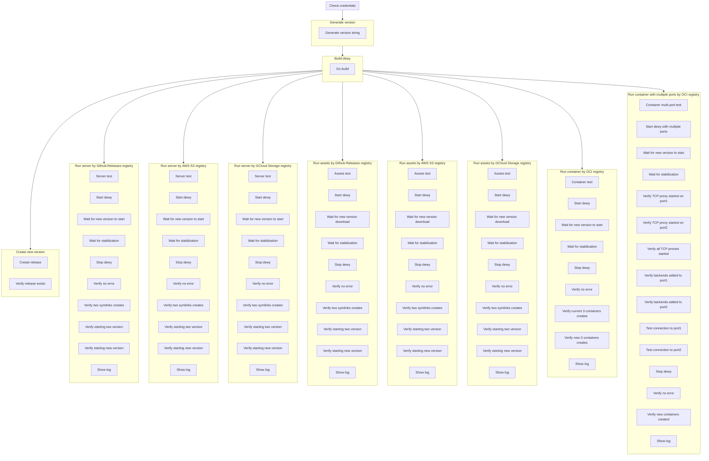

#  

Dewy uses comprehensive end-to-end (E2E) testing to ensure quality across all deployment modes and registry integrations. This testing is powered by [Probe](https://github.com/linyows/probe), a declarative workflow tool.

## Testing Philosophy

E2E tests verify that Dewy works correctly in real-world scenarios by:

- Building actual binaries
- Running Dewy processes with existing app versions
- Creating real new app releases on registries
- Verifying new app versions start correctly
- Checking deployment behavior and ensuring no errors in logs

## Test Coverage

The E2E test suite covers all combinations of commands and registries:

| Command | Registry | Description |
|---------|----------|-------------|
| `server` | GitHub Releases | Binary server deployment via GitHub |
| `server` | AWS S3 | Binary server deployment via S3 |
| `server` | Google Cloud Storage | Binary server deployment via GCS |
| `assets` | GitHub Releases | Static assets deployment via GitHub |
| `assets` | AWS S3 | Static assets deployment via S3 |
| `assets` | Google Cloud Storage | Static assets deployment via GCS |
| `container` | OCI Registry | Container deployment via GHCR |
| `container` (multi-port) | OCI Registry | Multi-port container deployment |

## Test Flow Visualization

The E2E test workflow can be visualized using Probe's DAG output:

```bash
probe --dag-mermaid testdata/e2e-test.yml
```

This generates a Mermaid diagram showing the test execution flow:



## Test Structure

### 1. Credential Verification

Before running tests, required credentials are verified:

- `GITHUB_TOKEN` - For GitHub Releases and GHCR access
- `AWS_ACCESS_KEY_ID` / `AWS_SECRET_ACCESS_KEY` - For S3 access
- `GOOGLE_APPLICATION_CREDENTIALS` - For GCS access

### 2. Build Phase

Dewy binaries are built for each test scenario:

```yaml
- name: Go build for {{ vars.command }}-{{ vars.registry }}
  uses: shell
  with:
    cmd: go build -o ./testdata/{{ vars.command }}/{{ vars.registry }}/dewy ./cmd/dewy
```

### 3. Release Creation

A test release is created on GitHub with a unique version:

```yaml
- name: Create release
  uses: shell
  with:
    cmd: |
      gh release create {{ outputs.genver.version }} \
        --repo linyows/dewy-testapp \
        --title {{ outputs.genver.version }} \
        --notes "End-to-end Testing by Probe"
```

### 4. Deployment Verification

Each test job verifies:

1. **Process startup** - Dewy starts successfully
2. **Version detection** - New version is detected and deployed
3. **Artifact handling** - Files are downloaded and extracted correctly
4. **Symlink creation** - Release symlinks are created
5. **Error-free operation** - No errors in logs
6. **Clean shutdown** - Process stops gracefully

### Container-Specific Verification

For container tests, additional checks include:

- Correct number of replicas running
- Container health checks passing
- TCP proxy functioning correctly
- Multi-port routing working
