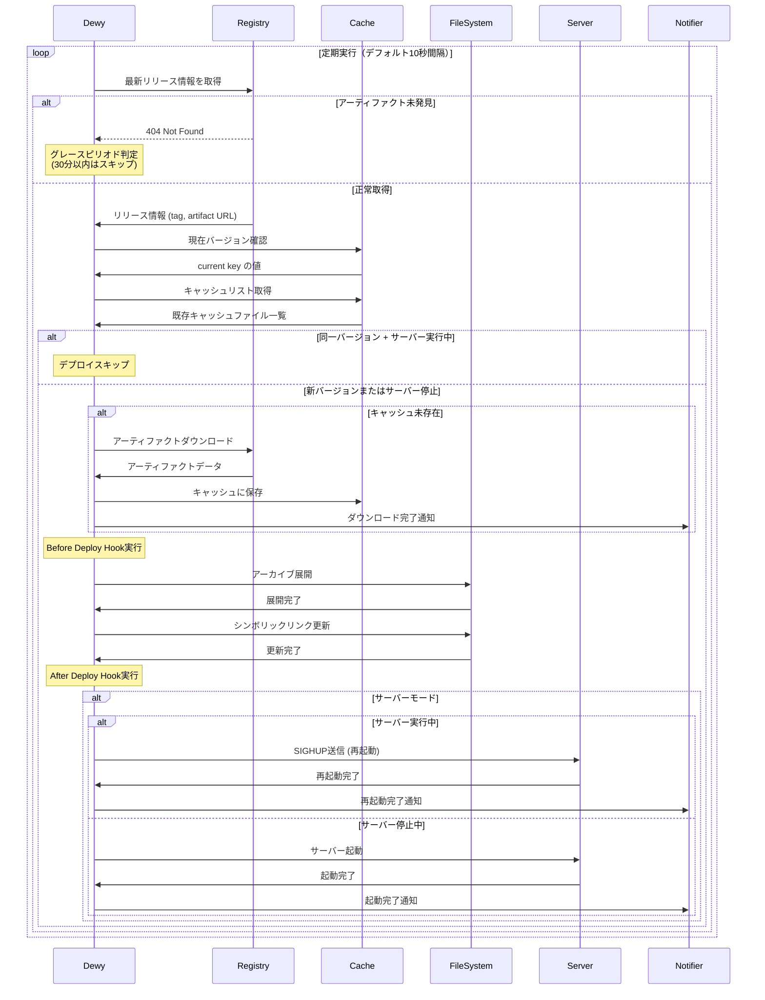
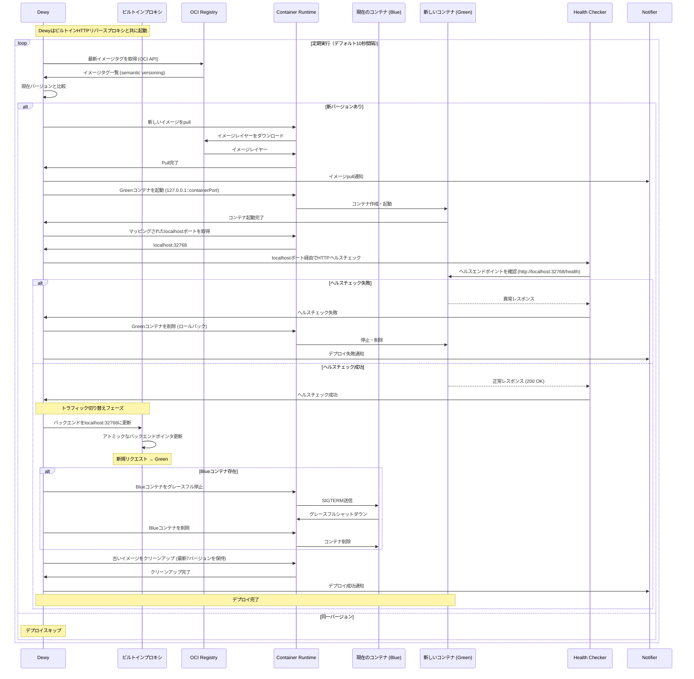
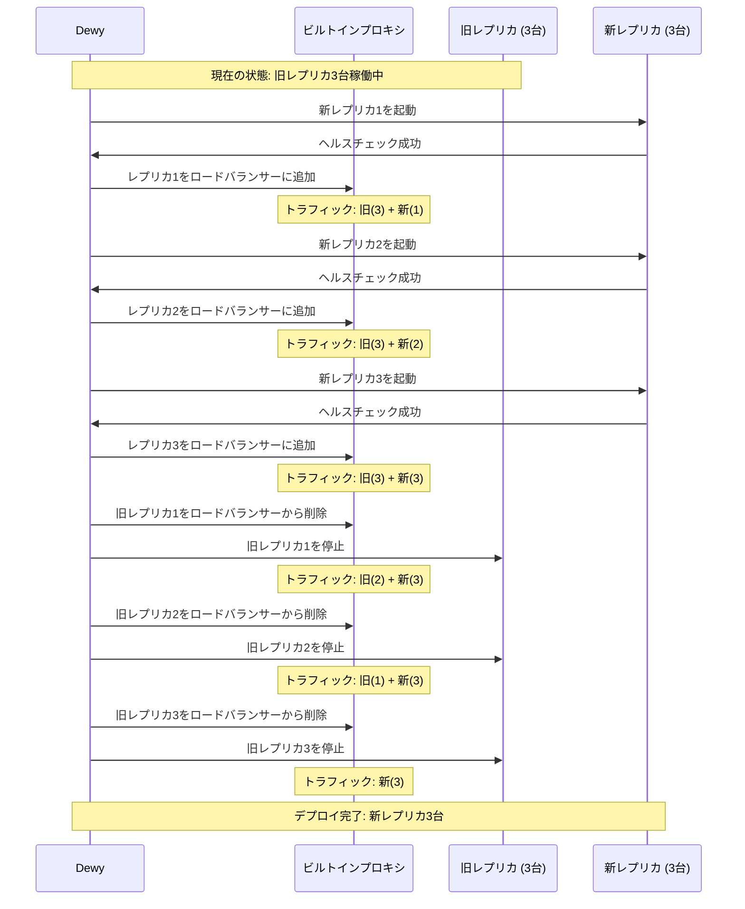

#  

dewyは自動化されたデプロイフローにより、継続的なアプリケーション配信を実現します。レジストリを定期的に監視し、新しいリリースを検出すると自動的にダウンロード、展開、デプロイを実行します。このプロセスは完全に自動化されており、手動操作なしに最新バージョンのアプリケーションを常に稼働状態に保つことができます。

## デプロイフローの全体像

dewyのデプロイフローは5つの主要なフェーズで構成され、各フェーズが連携して安全で効率的なデプロイメントを実現します。

デプロイフローは設定された間隔（デフォルト10秒）で繰り返し実行され、常に最新の状態を維持します。まず**定期チェック**でレジストリを監視し、新しいリリースを検出します。次に**バージョン比較**で現在実行中のバージョンと比較し、更新が必要かを判定します。更新が必要な場合は**アーティファクトダウンロード**でバイナリを取得し、**デプロイメント実行**でアプリケーションを展開します。最後に**アプリケーション制御**でサーバーの起動や再起動を管理します。

各フェーズでは適切なエラーハンドリングと通知が行われ、問題が発生した場合は管理者に自動的に報告されます。また、不要な処理を避けるための最適化も組み込まれており、システムリソースを効率的に使用します。

## フェーズ別の詳細処理

デプロイフローの各フェーズでは、特定の責務を持った処理が実行され、安全で確実なデプロイメントが保証されます。以下のシーケンス図は、dewyの典型的なデプロイフローを示しています。



### チェックフェーズ

チェックフェーズでは、設定されたレジストリに対して最新のリリース情報を取得します。GitHub Releases、S3、Google Cloud Storageなど、設定されたレジストリタイプに応じた方法で通信を行い、利用可能な最新バージョンの情報を収集します。

このフェーズでは**グレースピリオド**と呼ばれる重要な機能が実装されています。リリースが作成されてから30分以内にアーティファクトが見つからない場合、エラーとして扱わずに処理をスキップします。これにより、CI/CDシステムがリリースを作成した後、アーティファクトのビルドとアップロードが完了するまでの時間を考慮した運用が可能になります。

```bash
# グレースピリオド中のスキップログ例
DEBUG: Artifact not found within grace period message="artifact not found" grace_period=30m0s
```

### キャッシュフェーズ

キャッシュフェーズでは、取得したリリース情報を基にローカルキャッシュの状態を確認します。同じバージョンのアーティファクトが既にキャッシュされている場合、ダウンロード処理をスキップして効率化を図ります。

現在実行中のバージョン情報は `current` キーで管理され、新しいバージョンのキャッシュキー（`tag--artifact`形式）と比較されます。バージョンが同一で、かつサーバーが正常に動作している場合は、すべての後続処理がスキップされます。

```bash
# デプロイスキップ時のログ例
DEBUG: Deploy skipped
```

ただし、サーバーモードでアプリケーションの起動に失敗している場合は、キャッシュが存在してもデプロイ処理が継続されます。これにより、アプリケーションの問題を自動的に修復する機会が提供されます。

### ダウンロードフェーズ

ダウンロードフェーズでは、新しいバージョンのアーティファクトをレジストリからダウンロードし、ローカルキャッシュに保存します。ダウンロードは設定されたレジストリタイプに応じて最適化された方法で実行されます。

ダウンロードしたアーティファクトは、まずメモリ上のバッファに保存され、完全にダウンロードが完了してからキャッシュファイルとして永続化されます。この方法により、ダウンロード中の中断による破損ファイルの生成を防ぎます。

```bash
# ダウンロード完了時のログ例
INFO: Cached artifact cache_key="v1.2.3--myapp_linux_amd64.tar.gz"
INFO: Download notification message="Downloaded artifact for v1.2.3"
```

ダウンロード完了後は、通知システムを通じて管理者やチームに完了報告が送信されます。

### デプロイフェーズ

デプロイフェーズでは、キャッシュされたアーティファクトを展開し、アプリケーションディレクトリに配置します。このフェーズは最も重要な段階であり、複数のサブステップで構成されています。

まず、**Before Deploy Hook**が設定されている場合は実行されます。このフックにより、デプロイ前に必要な準備作業（データベースマイグレーション、サービス停止など）を自動化できます。フックが失敗してもデプロイは継続されますが、失敗は記録され通知されます。

次に、アーティファクトが`releases/YYYYMMDDTHHMMSSZ`形式のディレクトリに展開されます。展開処理では、tar.gz、zip、tar.bz2などの主要なアーカイブ形式がサポートされ、ファイル権限も適切に保持されます。

```bash
# デプロイ処理のログ例
INFO: Extract archive path="/opt/app/releases/20240115T103045Z"
INFO: Create symlink from="/opt/app/releases/20240115T103045Z" to="/opt/app/current"
```

展開完了後、`current`シンボリックリンクが新しいリリースディレクトリを指すように更新されます。既存のシンボリックリンクは事前に削除され、アトミックな切り替えが保証されます。

最後に、**After Deploy Hook**が設定されている場合は実行されます。このフックにより、デプロイ後の処理（キャッシュクリア、通知送信、サービス再開など）を自動化できます。

### 起動制御フェーズ

起動制御フェーズでは、サーバーモードでの動作時にアプリケーションの起動状態を管理します。assetsモードでは、ファイル配置のみが目的のため、この処理はスキップされます。

サーバーが既に実行中の場合は、**サーバー再起動**処理が実行されます。dewyは自身のプロセスにSIGHUPシグナルを送信し、server-starterライブラリによるグレースフルリスタートを実行します。この方法により、接続中のクライアントへの影響を最小限に抑えながら新しいバージョンに切り替えできます。

```bash
# サーバー再起動時のログ例
INFO: Send SIGHUP for server restart pid=12345
INFO: Restart notification message="Server restarted for v1.2.3"
```

サーバーが実行されていない場合は、**サーバー起動**処理が実行されます。server-starterを使用してアプリケーションプロセスを開始し、設定されたポートでのリスニングを開始します。

起動・再起動処理の完了後は、通知システムを通じて結果が報告され、運用チームは状況を把握できます。

## デプロイスキップ条件

dewyは効率的な運用のため、不要なデプロイ処理を自動的にスキップする機能を備えています。これにより、システムリソースの節約と安定した動作が実現されます。

### 同一バージョンでの重複デプロイ回避

最も基本的なスキップ条件は、現在実行中のバージョンと新しくチェックされたバージョンが同一の場合です。現在バージョン情報とキャッシュの存在確認により、同じアーティファクトの重複処理を防ぎます。

この判定は`current`キーに保存された値と、新しいリリースから生成されるキャッシュキーとの比較で行われます。完全に一致する場合、以降のすべての処理がスキップされ、"Deploy skipped"ログが出力されます。

### サーバー実行状態による判定

サーバーモードでの動作時は、アプリケーションの実行状態も考慮されます。同一バージョンかつサーバーが正常に実行されている場合は、処理をスキップして現在の状態を維持します。

ただし、サーバーの起動に失敗している状態が検出された場合は、同一バージョンでもデプロイ処理を実行します。これにより、設定変更やリソース問題などによる起動失敗を自動的に修復する機会が提供されます。

### assetsモードでの常時スキップ

assetsモードで動作している場合、同一バージョンの処理は常にスキップされます。静的ファイルの配置が主目的のため、サーバーの実行状態に関係なく、同じバージョンであれば再デプロイの必要がないと判断されます。

```bash
# assetsモードでのスキップ例
# 同一バージョンの場合は常にreturn nil
```

この動作により、CDNやWebサーバーでの静的ファイル配信において、無駄な処理を排除できます。

## エラーハンドリング

dewyのデプロイフローには、様々な障害状況に対応するための包括的なエラーハンドリング機能が組み込まれています。各段階で発生する可能性のある問題に対して、適切な対処と継続性の確保が行われます。

### アーティファクト未発見時のグレースピリオド

CI/CDシステムの特性を考慮して、リリース作成直後のアーティファクト未発見に対してはグレースピリオドが適用されます。リリースタグ作成から30分以内であれば、アーティファクトが見つからなくてもエラーとして扱われません。

この機能により、GitHub Actionsや他のCI/CDシステムがリリースを作成した後、ビルドプロセスの完了とアーティファクトアップロードまでの時間的猶予が確保されます。グレースピリオド中は警告ログが出力されますが、アラート通知は送信されません。

```go
// 30分のグレースピリオド設定
gracePeriod := 30 * time.Minute
if artifactNotFoundErr.IsWithinGracePeriod(gracePeriod) {
    // エラー通知を回避してreturn nil
    return nil
}
```

グレースピリオドを超過した場合は、通常のエラーとして処理され、管理者に通知が送信されます。

### デプロイフック失敗時の継続処理

Before Deploy HookやAfter Deploy Hookの実行が失敗した場合でも、デプロイ処理自体は継続されます。この設計により、補助的な処理の失敗がメインのデプロイメントを妨げることを防ぎます。

フックの失敗は詳細にログ記録され、通知システムを通じて管理者に報告されます。管理者は失敗の内容を確認し、必要に応じて手動で対処できます。

```bash
# フック失敗時のログ例
ERROR: Before deploy hook failure error="command failed with exit code 1"
```

Before Deploy Hookの失敗後もデプロイは継続され、After Deploy Hookも実行されます。この動作により、部分的な障害があっても可能な限りシステムの更新を完了させることができます。

### 各フェーズでのエラー処理と通知

各フェーズで発生するエラーは、種類に応じて適切にカテゴライズされ、対応する通知が送信されます。レジストリアクセスエラー、ダウンロード失敗、展開エラー、サーバー起動失敗など、それぞれに特化したエラーメッセージとログが生成されます。

致命的なエラーが発生した場合、以降の処理は中断され、システムは前の状態を維持します。これにより、不完全なデプロイによるサービス停止を防ぎます。一時的なエラーの場合は、次の定期チェックサイクルで自動的に再試行されます。

エラー情報は構造化ログとして記録され、監視システムでの自動分析や、管理者による詳細な調査に活用できます。

## 通知とロギング

dewyは包括的な通知とロギング機能により、デプロイメントの全過程を可視化し、運用チームが状況を正確に把握できるようにします。

### デプロイ開始・完了・失敗の通知

デプロイメントの重要な節目では、設定された通知チャンネル（Slack、メールなど）に自動的にメッセージが送信されます。デプロイ開始時には対象バージョンと処理内容が通知され、完了時には成功したバージョンと実行時間が報告されます。

```bash
# 通知メッセージの例
"Downloaded artifact for v1.2.3"
"Server restarted for v1.2.3"
"Automatic shipping started by Dewy (v1.0.0: server)"
```

失敗時には、エラーの詳細情報と推奨される対処方法が含まれた通知が送信されます。これにより、運用チームは迅速に問題を認識し、適切な対応を開始できます。

### フック実行結果の通知

Before Deploy HookとAfter Deploy Hookの実行結果は、詳細な実行情報とともに通知されます。成功時には実行時間と出力内容が、失敗時には終了コードとエラーメッセージが報告されます。

```bash
# フック実行結果の例
INFO: Execute hook command="npm run build" stdout="Build completed" duration="45.2s"
ERROR: After deploy hook failure error="Migration failed" exit_code=1
```

この情報により、自動化されたデプロイメントプロセスの各ステップを詳細に追跡し、問題の早期発見と解決に役立てることができます。

### 各段階での詳細ログ出力

dewyは構造化ログを使用して、デプロイフローの各段階で詳細な情報を記録します。ログレベルに応じて、デバッグ情報から重要なイベントまで、必要な粒度で情報を収集できます。

主要なログエントリには、タイムスタンプ、ログレベル、メッセージ、および関連するメタデータ（バージョン、キャッシュキー、プロセスIDなど）が含まれます。これにより、問題の調査時に必要な情報を迅速に特定できます。

```json
{"time":"2024-01-15T10:30:45Z","level":"INFO","msg":"Dewy started","version":"v1.0.0","commit":"abc1234"}
{"time":"2024-01-15T10:30:46Z","level":"INFO","msg":"Cached artifact","cache_key":"v1.2.3--myapp_linux_amd64.tar.gz"}
{"time":"2024-01-15T10:30:47Z","level":"DEBUG","msg":"Deploy skipped"}
```

ログ情報は、リアルタイム監視、トレンド分析、パフォーマンス最適化、および監査要件の満足に活用され、dewyの運用における重要な基盤となります。

## コンテナデプロイフロー

コンテナモード（`dewy container`）で動作する場合、デプロイフローはバイナリデプロイメントとは大きく異なります。コンテナデプロイメントは、localhost専用ポートマッピングとビルトインリバースプロキシを使用したローリングアップデート戦略により、ゼロダウンタイムの更新を実現します。

### コンテナデプロイシーケンス

以下のシーケンス図は、ビルトインプロキシとlocalhost専用ポートマッピングを使用したコンテナデプロイフローを示しています：



### コンテナデプロイフェーズ

#### 1. イメージチェックフェーズ

コンテナデプロイフローでは、チェックフェーズでOCI/Docker RegistryにDistribution API (v2)を使用してクエリを実行します。GitHub ReleasesやS3をチェックするバイナリデプロイメントとは異なり、コンテナデプロイメントは：

- `GET /v2/<name>/tags/list`を使用してイメージタグを取得
- Semantic Versioningルールでタグをフィルタリング
- クエリパラメータでプレリリースタグをサポート
- Docker config.jsonまたは環境変数で認証

```bash
# レジストリURLの例
img://ghcr.io/linyows/myapp
img://us-central1-docker.pkg.dev/project-id/myapp-repo/myapp
img://docker.io/library/nginx
```

#### 2. イメージPullフェーズ

新しいバージョンが検出されると、dewyはコンテナランタイムにイメージのpullを指示します：

```bash
# イメージpull時のログ例
INFO: Pulling new image image="ghcr.io/linyows/myapp:v1.2.3"
INFO: Image pull complete digest="sha256:abc123..."
INFO: Image pull notification message="Pulled image v1.2.3"
```

コンテナイメージは複数のレイヤーで構成されており、コンテナランタイムによってキャッシュされます。変更されたレイヤーのみがダウンロードされるため、インクリメンタルな更新ではデプロイ時間が大幅に短縮されます。

#### 3. ローリングアップデートデプロイフェーズ

コンテナデプロイメントは、ゼロダウンタイム更新のためにlocalhost専用ポートマッピングとビルトインプロキシを使用したローリングアップデート戦略を採用しています。このフェーズは以下のステップで構成されています：

**ステップ1: localhost専用ポートでGreenコンテナ起動**

新バージョンのコンテナ（Green）は、localhost専用ポートマッピング（`127.0.0.1::containerPort`）で起動されます：

```bash
# ログ例
INFO: Starting new container name="myapp-1234567890" port_mapping="127.0.0.1::8080"
INFO: Container started mapped_port=32768
```

Dockerはランダムなlocalhostポート（例: 32768）を割り当て、コンテナは外部ネットワークから直接アクセスできません。

**ステップ2: localhost経由でヘルスチェック**

Dewyはマッピングされたlocalhostポートを使用してGreenコンテナに対してヘルスチェックを実行します：

```bash
# localhost経由のHTTPヘルスチェック
INFO: Health checking new container url="http://localhost:32768/health"
INFO: Health check passed status=200 duration="50ms"
```

ヘルスチェックが失敗した場合、Greenコンテナは即座に削除され（ロールバック）、Blueコンテナがトラフィックを処理し続けます。

**ステップ3: プロキシバックエンドのアトミック切り替え**

ヘルスチェックが成功すると、dewyはビルトインプロキシのバックエンドをアトミックに更新します：

```bash
INFO: Updating proxy backend new_backend="http://localhost:32768"
INFO: Proxy backend updated successfully
```

この操作はGoの`sync.RWMutex`を使用してアトミックに実行され、リクエストのロスなしに瞬時に切り替わります。

**ステップ4: 旧コンテナの即時削除**

バックエンド切り替え後、Blueコンテナは即座にグレースフル停止・削除されます：

```bash
INFO: Stopping old container gracefully container="myapp-1234567880"
INFO: Deployment completed successfully container="myapp-1234567890"
```

Drain期間は不要です。プロキシのアトミック切り替えにより、すべての新規リクエストは即座に新しいコンテナに向かいます。

**ステップ5: イメージクリーンアップ**

古いコンテナイメージは自動的にクリーンアップされます（最新7バージョンを保持）：

```bash
INFO: Cleaning up old images repository="ghcr.io/linyows/myapp"
INFO: Removed 3 old images kept=7
```

### コンテナデプロイ vs バイナリデプロイ

コンテナデプロイメントとバイナリデプロイメントフローの主な違い：

| 項目 | バイナリデプロイメント | コンテナデプロイメント |
|------|---------------------|---------------------|
| **アーティファクトソース** | GitHub Releases, S3, GCS | OCIレジストリ (Docker Hub, GHCR等) |
| **アーティファクト形式** | tar.gz, zipアーカイブ | OCIイメージ (マルチレイヤー) |
| **デプロイ戦略** | インプレース更新 + SIGHUP | ローリングアップデートとプロキシ |
| **ダウンタイム** | 最小限 (再起動時間) | ゼロ (シームレス切り替え) |
| **ロールバック** | 前のリリースディレクトリ | 自動ロールバック（ヘルスチェック失敗時） |
| **ヘルスチェック** | プロセスベース | HTTP/TCPエンドポイント |
| **トラフィック管理** | server-starter (ポート引き継ぎ) | ビルトインリバースプロキシ |
| **ネットワークセキュリティ** | N/A | localhost専用 (127.0.0.1) |

### ネットワークアーキテクチャ

コンテナデプロイメントはビルトインリバースプロキシとlocalhost専用ポートマッピングを使用します：

```
[外部クライアント]
       ↓
   [Dewy ビルトインプロキシ :8000]  ← --port 8000 (外部アクセス)
       ↓ アトミックなバックエンド切り替え
   [localhost:32768]  ← Dockerポートマッピング (127.0.0.1::8080)
       ↓
   [コンテナ:8080]  ← アプリコンテナ (--container-port 8080)
```

**セキュリティ上の利点：**
- コンテナは外部ネットワークから直接アクセスできません
- localhostポートのみで公開されます
- すべての外部トラフィックはDewyのビルトインプロキシを経由します

### コンテナデプロイのエラーハンドリング

コンテナデプロイメントには特定のエラーハンドリングメカニズムが含まれています：

#### ヘルスチェック失敗

Greenコンテナのヘルスチェックが失敗すると、自動ロールバックが発生します：

```bash
ERROR: Health check failed error="connection refused" attempts=5
INFO: Rolling back deployment
INFO: Removing failed container container="myapp-green-1234567890"
```

Blueコンテナは動作を継続し、サービスの継続性を保証します。

#### イメージPull失敗

ネットワーク問題や認証問題でイメージのpullが失敗した場合：

```bash
ERROR: Image pull failed error="authentication required" image="ghcr.io/linyows/myapp:v1.2.3"
```

システムは次のポーリング間隔で再試行します。現在のコンテナは変更なく動作し続けます。

#### コンテナ起動失敗

Greenコンテナの起動が失敗した場合（無効な設定、依存関係の欠落など）：

```bash
ERROR: Container start failed error="port already in use: 8080"
INFO: Removing failed container
```

Dewyは失敗したコンテナを削除し、現在のバージョンを本番環境で維持します。

### コンテナデプロイの通知

コンテナ固有の通知には追加情報が含まれます：

```bash
# Pull通知
"Pulled image ghcr.io/linyows/myapp:v1.2.3 (digest: sha256:abc123...)"

# デプロイ開始
"Starting rolling update deployment: v1.2.2 → v1.2.3"

# コンテナ起動
"Container started with localhost-only port mapping (127.0.0.1:32768)"

# ヘルスチェック成功
"Health check passed for new container (200 OK, 45ms)"

# プロキシバックエンド更新
"Proxy backend updated to http://localhost:32768"

# イメージクリーンアップ
"Cleaned up 3 old images (kept last 7 versions)"

# デプロイ完了
"Deployment completed successfully (total: 15s)"
```

これらの通知により、コンテナデプロイメントプロセスの詳細な可視性が提供され、運用チームがデプロイの進行状況を追跡し、問題を迅速に診断できるようになります。

## 複数コンテナレプリカ

Dewyは複数のコンテナレプリカを実行することで、可用性の向上と負荷分散をサポートします。ビルトインリバースプロキシは、ラウンドロビンアルゴリズムを使用して、すべての正常なレプリカに自動的にリクエストを負荷分散します。

### ロードバランシング

複数のレプリカが構成されている場合、リバースプロキシは受信リクエストを均等に分散します：

```
Request 1 → Container 1 (localhost:32768)
Request 2 → Container 2 (localhost:32770)
Request 3 → Container 3 (localhost:32772)
Request 4 → Container 1 (localhost:32768)  # ラウンドロビン
...
```

**主な機能：**
- 均等なトラフィック分散のためのラウンドロビンロードバランシング
- 各コンテナは独自のlocalhostポートで実行
- すべてのレプリカに対する自動ヘルスチェック
- 失敗したコンテナは自動的にローテーションから除外

### ローリングアップデートデプロイ

複数レプリカで新バージョンをデプロイする際、Dewyは段階的なローリングアップデートを実行します：



**ローリングアップデートプロセス：**
1. 新しいレプリカを1台ずつ起動
2. 各新レプリカのヘルスチェック
3. 正常なレプリカをロードバランサーに追加
4. すべての新レプリカが起動した後、旧レプリカを1台ずつ削除
5. 段階的な移行により継続的な可用性を確保

**メリット：**
- 更新中もゼロダウンタイム
- ヘルスチェック失敗時の自動ロールバック
- デプロイ中も常に容量を維持
- 段階的なロールアウトによりリスクを軽減

### 例：複数レプリカ

```bash
# 高可用性のため3つのレプリカで実行
dewy container \
  --registry "img://ghcr.io/linyows/myapp?pre-release=true" \
  --container-port 8080 \
  --replicas 3 \
  --health-path /health \
  --health-timeout 30 \
  --port 8000 \
  --log-level info

# ローリングデプロイメントの出力:
# INFO: Starting container deployment replicas=3
# INFO: Pulling new image image=ghcr.io/linyows/myapp:v1.2.3
# INFO: Found existing containers count=0
# INFO: Starting new container replica=1 total=3
# INFO: Container started container=abc123... mapped_port=32768
# INFO: Health check passed url=http://localhost:32768/health
# INFO: Container added to load balancer backend_count=1
# INFO: Starting new container replica=2 total=3
# INFO: Container started container=def456... mapped_port=32770
# INFO: Health check passed url=http://localhost:32770/health
# INFO: Container added to load balancer backend_count=2
# INFO: Starting new container replica=3 total=3
# INFO: Container started container=ghi789... mapped_port=32772
# INFO: Health check passed url=http://localhost:32772/health
# INFO: Container added to load balancer backend_count=3
# INFO: Container deployment completed new_containers=3

# すべてのレプリカがラウンドロビンでトラフィックを処理
curl http://localhost:8000/  # → コンテナ1
curl http://localhost:8000/  # → コンテナ2
curl http://localhost:8000/  # → コンテナ3
curl http://localhost:8000/  # → コンテナ1（ラウンドロビン）
```

### 複数レプリカのユースケース

**高可用性：**
- 1台のレプリカがクラッシュしても、他のレプリカがトラフィックを処理し続ける
- 単一障害点がない
- 回復力の向上

**負荷分散：**
- CPU集約型のワークロードは並列処理の恩恵を受ける
- リソース使用率の向上
- トラフィックスパイクをより効果的に処理

**ゼロダウンタイム更新：**
- ローリングアップデートにより継続的なサービスを保証
- 段階的なロールアウトによりデプロイリスクを軽減
- 常に最小限の容量を維持

**推奨構成：**
- **本番環境**: 高可用性のため3〜5レプリカ
- **開発環境**: リソース節約のため1レプリカ
- **ステージング環境**: マルチインスタンスシナリオをテストするため2レプリカ