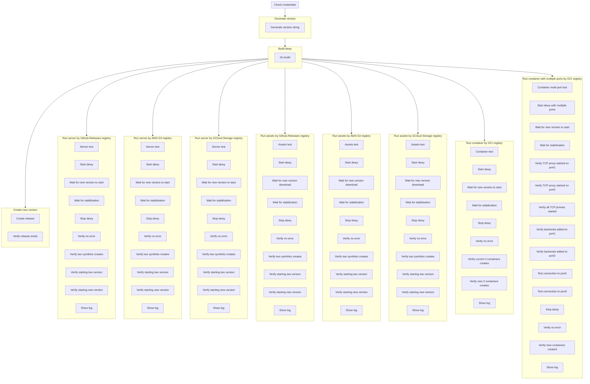

#  

Dewyは、すべてのデプロイメントモードとレジストリ統合の品質を保証するために、包括的なエンドツーエンド（E2E）テストを使用しています。このテストは、宣言的ワークフローツールである[Probe](https://github.com/linyows/probe)によって実行されます。

## テストの思想

E2Eテストは、以下の方法で実際のシナリオでDewyが正しく動作することを検証します：

- 実際のバイナリをビルド
- Dewyプロセスを実行し既存アプリのバージョンが動く
- レジストリに実際の新しいアプリのリリースを作成
- 新しいアプリのバージョンが動く
- デプロイ動作を検証しログにエラーがないことを確認

## テストカバレッジ

E2Eテストスイートは、コマンドとレジストリのすべての組み合わせをカバーしています：

| コマンド | レジストリ | 説明 |
|---------|----------|-------------|
| `server` | GitHub Releases | GitHub経由のバイナリサーバーデプロイ |
| `server` | AWS S3 | S3経由のバイナリサーバーデプロイ |
| `server` | Google Cloud Storage | GCS経由のバイナリサーバーデプロイ |
| `assets` | GitHub Releases | GitHub経由の静的アセットデプロイ |
| `assets` | AWS S3 | S3経由の静的アセットデプロイ |
| `assets` | Google Cloud Storage | GCS経由の静的アセットデプロイ |
| `container` | OCI Registry | GHCR経由のコンテナデプロイ |
| `container` (multi-port) | OCI Registry | マルチポートコンテナデプロイ |

## テストフローの可視化

E2Eテストのワークフローは、ProbeのDAG出力を使用して可視化できます：

```bash
probe --dag-mermaid testdata/e2e-test.yml
```

これにより、テスト実行フローを示すMermaid図が生成されます：



## テスト構造

### 1. 認証情報の検証

テスト実行前に、必要な認証情報を検証します：

- `GITHUB_TOKEN` - GitHub ReleasesとGHCRアクセス用
- `AWS_ACCESS_KEY_ID` / `AWS_SECRET_ACCESS_KEY` - S3アクセス用
- `GOOGLE_APPLICATION_CREDENTIALS` - GCSアクセス用

### 2. ビルドフェーズ

各テストシナリオ用にDewyバイナリがビルドされます：

```yaml
- name: Go build for {{ vars.command }}-{{ vars.registry }}
  uses: shell
  with:
    cmd: go build -o ./testdata/{{ vars.command }}/{{ vars.registry }}/dewy ./cmd/dewy
```

### 3. リリース作成

一意のバージョンでGitHubにテストリリースが作成されます：

```yaml
- name: Create release
  uses: shell
  with:
    cmd: |
      gh release create {{ outputs.genver.version }} \
        --repo linyows/dewy-testapp \
        --title {{ outputs.genver.version }} \
        --notes "End-to-end Testing by Probe"
```

### 4. デプロイの検証

各テストジョブは以下を検証します：

1. **プロセス起動** - Dewyが正常に起動する
2. **バージョン検出** - 新バージョンが検出されデプロイされる
3. **アーティファクト処理** - ファイルが正しくダウンロード・展開される
4. **シンボリックリンク作成** - リリースのシンボリックリンクが作成される
5. **エラーフリー動作** - ログにエラーがない
6. **クリーンシャットダウン** - プロセスが正常に停止する

### コンテナ固有の検証

コンテナテストでは、追加のチェックが含まれます：

- 正しい数のレプリカが実行されている
- コンテナのヘルスチェックが合格している
- TCPプロキシが正しく機能している
- マルチポートルーティングが動作している
