# E2E Tests

End-to-end tests that verify dewy's deployment lifecycle works correctly against real registries and external services. These tests are executed by [Probe](https://github.com/linyows/probe) via GitHub Actions.

## What These Tests Guarantee

The E2E tests ensure that dewy can:

1. **Detect and deploy an initial version** from a registry, creating the correct symlink structure
2. **Detect a new version** published to the registry and perform a rolling update
3. **Notify** deployment events to Slack (server command with Slack notifier)
4. **Manage containers** including health checks, replica scaling, and non-root execution
5. **Handle multiple port mappings** with TCP proxy for container deployments

All of the above are verified across every supported combination of commands and registries:

| Command | Registry | Description |
|---|---|---|
| `server` | GitHub Releases (`ghr`) | Process management with symlink-based deployment |
| `server` | AWS S3 (`s3`) | Same as above, sourced from S3 |
| `server` | Google Cloud Storage (`gs`) | Same as above, sourced from GCS |
| `server` | GitHub Releases + S3 shared cache | Pair of instances pointed at the same S3 cache prefix; verifies the new S3 cache backend deploys correctly and reduces upstream downloads when shared |
| `server` | GitHub Releases + GCS shared cache | Same as above for the GCS cache backend |
| `assets` | GitHub Releases (`ghr`) | Static asset download and symlink management |
| `assets` | AWS S3 (`s3`) | Same as above, sourced from S3 |
| `assets` | Google Cloud Storage (`gs`) | Same as above, sourced from GCS |
| `container` | OCI / ghcr.io (`img`) | Container deployment with 3 replicas |
| `container` | Docker Hub (`img`) | Same as above, sourced from Docker Hub |
| `container` (multi-port) | OCI / ghcr.io (`img`) | Container deployment with 2 replicas and 2 port mappings |

### Verification Details

**Server / Assets commands:**
- No errors in log output
- Two symlinks created (initial + updated version)
- Two versions started/downloaded (initial + new)
- New version string appears in log

**Shared cache pairs (server with `--cache s3://...?registry-ttl=30s` / `gs://...?registry-ttl=30s`):**
- All of the above for each instance in the pair
- Total `Cached artifact` log lines across the pair is `<= 3` (ideal `2`). Each instance only logs `Cached artifact` when it actually downloads from upstream and writes to the cache, so without sharing the total would be `4` (2 instances × 2 versions). With sharing, the second instance hits the cache and skips the download. The `<= 3` bound tolerates a single race on either deploy cycle.
- Total `Registry result refreshed from upstream` log lines across the pair is `>= 1` and `<= 20`. The decorator only logs this when an instance acquires the refresh lock and actually calls upstream. Without the registry-result cache the pair would log it on every poll (~36-60 across the run), so the upper bound demonstrates that single-flight refresh is working. The lower bound asserts that the cache fired at least once.

**Container command:**
- No errors in log output (excluding transient `context deadline exceeded`)
- Correct number of containers created for both initial and new versions
- Containers run as non-root user

**Container multi-port command:**
- All of the above container checks
- TCP proxy started on each mapped port
- Backends registered for each port with correct replica count
- HTTP health check returns 200 on both ports

## Architecture

The following diagram is generated by `probe dag --mermaid e2e/test.yml`:

```mermaid
flowchart LR
    subgraph check["Check credentials"]
        check_step0["GITHUB_TOKEN is not empty"]
        check_step1["AWS_ACCESS_KEY_ID is not empty"]
        check_step2["AWS_SECRET_ACCESS_KEY is not empty"]
        check_step3["GOOGLE_APPLICATION_CREDENTIALS is not empty"]
        check_step4["SLACK_TOKEN is not empty"]
    end
    subgraph generate_version["Generate version"]
        generate_version_step0["Generate version string"]
    end
    subgraph build["Build dewy"]
        build_step0["Go build for {{ vars.command }}-{{ vars.variant }}"]
    end
    subgraph start_srv_ghr["Start server by Github-Releases registry with Slack notification"]
        start_srv_ghr_step0["Start dewy"]
        start_srv_ghr_step1["Wait for initial deployment"]
    end
    subgraph start_srv_s3["Start server by AWS S3 registry with Slack notification"]
        start_srv_s3_step0["Start dewy"]
        start_srv_s3_step1["Wait for initial deployment"]
    end
    subgraph start_srv_gs["Start server by GCloud Storage registry with Slack notification"]
        start_srv_gs_step0["Start dewy"]
        start_srv_gs_step1["Wait for initial deployment"]
    end
    subgraph start_srv_ghr_s3cache_a["Start server by Github-Releases registry with S3 shared cache (A)"]
        start_srv_ghr_s3cache_a_step0["Start dewy"]
        start_srv_ghr_s3cache_a_step1["Wait for initial deployment"]
    end
    subgraph start_srv_ghr_s3cache_b["Start server by Github-Releases registry with S3 shared cache (B)"]
        start_srv_ghr_s3cache_b_step0["Start dewy"]
        start_srv_ghr_s3cache_b_step1["Wait for initial deployment"]
    end
    subgraph start_srv_ghr_gscache_a["Start server by Github-Releases registry with GCS shared cache (A)"]
        start_srv_ghr_gscache_a_step0["Start dewy"]
        start_srv_ghr_gscache_a_step1["Wait for initial deployment"]
    end
    subgraph start_srv_ghr_gscache_b["Start server by Github-Releases registry with GCS shared cache (B)"]
        start_srv_ghr_gscache_b_step0["Start dewy"]
        start_srv_ghr_gscache_b_step1["Wait for initial deployment"]
    end
    subgraph start_ast_ghr["Start assets by Github-Releases registry"]
        start_ast_ghr_step0["Start dewy"]
        start_ast_ghr_step1["Wait for initial deployment"]
    end
    subgraph start_ast_s3["Start assets by AWS S3 registry"]
        start_ast_s3_step0["Start dewy"]
        start_ast_s3_step1["Wait for initial deployment"]
    end
    subgraph start_ast_gs["Start assets by GCloud Storage registry"]
        start_ast_gs_step0["Start dewy"]
        start_ast_gs_step1["Wait for initial deployment"]
    end
    subgraph start_ctr_oci["Start container by OCI registry"]
        start_ctr_oci_step0["Start dewy"]
        start_ctr_oci_step1["Wait for initial deployment"]
    end
    subgraph start_ctr_podman["Start container by OCI registry with Podman runtime"]
        start_ctr_podman_step0["Start dewy"]
        start_ctr_podman_step1["Wait for initial deployment"]
    end
    subgraph start_ctr_dockerhub["Start container by Docker Hub registry"]
        start_ctr_dockerhub_step0["Start dewy"]
        start_ctr_dockerhub_step1["Wait for initial deployment"]
    end
    subgraph start_ctr_mp_oci["Start container with multiple ports by OCI registry"]
        start_ctr_mp_oci_step0["Start dewy"]
        start_ctr_mp_oci_step1["Wait for initial deployment"]
    end
    subgraph create_release["Create new version"]
        create_release_step0["Create release"]
        create_release_step1["Verify release exists"]
    end
    subgraph job_18["Verify server by Github-Releases registry"]
        job_18_step0["Server verify"]
        job_18_step1["Wait for new version to start"]
        job_18_step2["Wait for stabilization"]
        job_18_step3["Stop dewy"]
        job_18_step4["Verify no error"]
        job_18_step5["Verify two symlinks creates"]
        job_18_step6["Verify starting two version"]
        job_18_step7["Verify starting new version"]
        job_18_step8["Show log"]
    end
    subgraph job_19["Verify server by AWS S3 registry"]
        job_19_step0["Server verify"]
        job_19_step1["Wait for new version to start"]
        job_19_step2["Wait for stabilization"]
        job_19_step3["Stop dewy"]
        job_19_step4["Verify no error"]
        job_19_step5["Verify two symlinks creates"]
        job_19_step6["Verify starting two version"]
        job_19_step7["Verify starting new version"]
        job_19_step8["Show log"]
    end
    subgraph job_20["Verify server by GCloud Storage registry"]
        job_20_step0["Server verify"]
        job_20_step1["Wait for new version to start"]
        job_20_step2["Wait for stabilization"]
        job_20_step3["Stop dewy"]
        job_20_step4["Verify no error"]
        job_20_step5["Verify two symlinks creates"]
        job_20_step6["Verify starting two version"]
        job_20_step7["Verify starting new version"]
        job_20_step8["Show log"]
    end
    subgraph verify_srv_ghr_s3cache_a["Verify server by Github-Releases registry with S3 shared cache (A)"]
        verify_srv_ghr_s3cache_a_step0["Server verify"]
        verify_srv_ghr_s3cache_a_step1["Wait for new version to start"]
        verify_srv_ghr_s3cache_a_step2["Wait for stabilization"]
        verify_srv_ghr_s3cache_a_step3["Stop dewy"]
        verify_srv_ghr_s3cache_a_step4["Verify no error"]
        verify_srv_ghr_s3cache_a_step5["Verify two symlinks creates"]
        verify_srv_ghr_s3cache_a_step6["Verify starting two version"]
        verify_srv_ghr_s3cache_a_step7["Verify starting new version"]
        verify_srv_ghr_s3cache_a_step8["Show log"]
    end
    subgraph verify_srv_ghr_s3cache_b["Verify server by Github-Releases registry with S3 shared cache (B)"]
        verify_srv_ghr_s3cache_b_step0["Server verify"]
        verify_srv_ghr_s3cache_b_step1["Wait for new version to start"]
        verify_srv_ghr_s3cache_b_step2["Wait for stabilization"]
        verify_srv_ghr_s3cache_b_step3["Stop dewy"]
        verify_srv_ghr_s3cache_b_step4["Verify no error"]
        verify_srv_ghr_s3cache_b_step5["Verify two symlinks creates"]
        verify_srv_ghr_s3cache_b_step6["Verify starting two version"]
        verify_srv_ghr_s3cache_b_step7["Verify starting new version"]
        verify_srv_ghr_s3cache_b_step8["Show log"]
    end
    subgraph verify_srv_ghr_gscache_a["Verify server by Github-Releases registry with GCS shared cache (A)"]
        verify_srv_ghr_gscache_a_step0["Server verify"]
        verify_srv_ghr_gscache_a_step1["Wait for new version to start"]
        verify_srv_ghr_gscache_a_step2["Wait for stabilization"]
        verify_srv_ghr_gscache_a_step3["Stop dewy"]
        verify_srv_ghr_gscache_a_step4["Verify no error"]
        verify_srv_ghr_gscache_a_step5["Verify two symlinks creates"]
        verify_srv_ghr_gscache_a_step6["Verify starting two version"]
        verify_srv_ghr_gscache_a_step7["Verify starting new version"]
        verify_srv_ghr_gscache_a_step8["Show log"]
    end
    subgraph verify_srv_ghr_gscache_b["Verify server by Github-Releases registry with GCS shared cache (B)"]
        verify_srv_ghr_gscache_b_step0["Server verify"]
        verify_srv_ghr_gscache_b_step1["Wait for new version to start"]
        verify_srv_ghr_gscache_b_step2["Wait for stabilization"]
        verify_srv_ghr_gscache_b_step3["Stop dewy"]
        verify_srv_ghr_gscache_b_step4["Verify no error"]
        verify_srv_ghr_gscache_b_step5["Verify two symlinks creates"]
        verify_srv_ghr_gscache_b_step6["Verify starting two version"]
        verify_srv_ghr_gscache_b_step7["Verify starting new version"]
        verify_srv_ghr_gscache_b_step8["Show log"]
    end
    subgraph job_25["Verify assets by Github-Releases registry"]
        job_25_step0["Assets verify"]
        job_25_step1["Wait for new version download"]
        job_25_step2["Wait for stabilization"]
        job_25_step3["Stop dewy"]
        job_25_step4["Verify no error"]
        job_25_step5["Verify two symlinks creates"]
        job_25_step6["Verify starting two version"]
        job_25_step7["Verify starting new version"]
        job_25_step8["Show log"]
    end
    subgraph job_26["Verify assets by AWS S3 registry"]
        job_26_step0["Assets verify"]
        job_26_step1["Wait for new version download"]
        job_26_step2["Wait for stabilization"]
        job_26_step3["Stop dewy"]
        job_26_step4["Verify no error"]
        job_26_step5["Verify two symlinks creates"]
        job_26_step6["Verify starting two version"]
        job_26_step7["Verify starting new version"]
        job_26_step8["Show log"]
    end
    subgraph job_27["Verify assets by GCloud Storage registry"]
        job_27_step0["Assets verify"]
        job_27_step1["Wait for new version download"]
        job_27_step2["Wait for stabilization"]
        job_27_step3["Stop dewy"]
        job_27_step4["Verify no error"]
        job_27_step5["Verify two symlinks creates"]
        job_27_step6["Verify starting two version"]
        job_27_step7["Verify starting new version"]
        job_27_step8["Show log"]
    end
    subgraph job_28["Verify container by OCI registry"]
        job_28_step0["Container verify"]
        job_28_step1["Wait for new version to start"]
        job_28_step2["Wait for stabilization"]
        job_28_step3["Verify containers are not running as root"]
        job_28_step4["Stop dewy"]
        job_28_step5["Verify no error"]
        job_28_step6["Verify current 3 containers creates"]
        job_28_step7["Verify new 3 containers creates"]
        job_28_step8["Show log"]
    end
    subgraph job_29["Verify container by OCI registry with Podman runtime"]
        job_29_step0["Container verify"]
        job_29_step1["Wait for new version to start"]
        job_29_step2["Wait for stabilization"]
        job_29_step3["Verify containers are not running as root"]
        job_29_step4["Stop dewy"]
        job_29_step5["Verify no error"]
        job_29_step6["Verify current 3 containers creates"]
        job_29_step7["Verify new 3 containers creates"]
        job_29_step8["Show log"]
    end
    subgraph job_30["Verify container by Docker Hub registry"]
        job_30_step0["Container verify"]
        job_30_step1["Wait for new version to start"]
        job_30_step2["Wait for stabilization"]
        job_30_step3["Verify containers are not running as root"]
        job_30_step4["Stop dewy"]
        job_30_step5["Verify no error"]
        job_30_step6["Verify current 3 containers creates"]
        job_30_step7["Verify new 3 containers creates"]
        job_30_step8["Show log"]
    end
    subgraph job_31["Verify container with multiple ports by OCI registry"]
        job_31_step0["Container multi-port verify"]
        job_31_step1["Wait for new version to start"]
        job_31_step2["Wait for stabilization"]
        job_31_step3["Verify TCP proxy started on port1"]
        job_31_step4["Verify TCP proxy started on port2"]
        job_31_step5["Verify all TCP proxies started"]
        job_31_step6["Verify backends added to port1"]
        job_31_step7["Verify backends added to port2"]
        job_31_step8["Test connection to port1"]
        job_31_step9["Test connection to port2"]
        job_31_step10["Verify containers are not running as root"]
        job_31_step11["Stop dewy"]
        job_31_step12["Verify no error"]
        job_31_step13["Verify new containers created"]
        job_31_step14["Show log"]
    end
    subgraph job_32["Verify shared cache reduces upstream downloads (S3 pair)"]
        job_32_step0["Count #quot;Cached artifact#quot; log lines across S3 pair"]
    end
    subgraph job_33["Verify shared cache reduces upstream downloads (GCS pair)"]
        job_33_step0["Count #quot;Cached artifact#quot; log lines across GCS pair"]
    end
    subgraph job_34["Verify registry result cache reduces upstream polls (S3 pair)"]
        job_34_step0["Count #quot;Registry result refreshed from upstream#quot; log lines across S3 pair"]
    end
    subgraph job_35["Verify registry result cache reduces upstream polls (GCS pair)"]
        job_35_step0["Count #quot;Registry result refreshed from upstream#quot; log lines across GCS pair"]
    end

    check --> generate_version
    generate_version --> build
    build --> start_srv_ghr
    build --> start_srv_s3
    build --> start_srv_gs
    build --> start_srv_ghr_s3cache_a
    start_srv_ghr_s3cache_a --> start_srv_ghr_s3cache_b
    build --> start_srv_ghr_gscache_a
    start_srv_ghr_gscache_a --> start_srv_ghr_gscache_b
    build --> start_ast_ghr
    build --> start_ast_s3
    build --> start_ast_gs
    build --> start_ctr_oci
    build --> start_ctr_podman
    build --> start_ctr_dockerhub
    build --> start_ctr_mp_oci
    start_srv_ghr --> create_release
    start_srv_s3 --> create_release
    start_srv_gs --> create_release
    start_srv_ghr_s3cache_b --> create_release
    start_srv_ghr_gscache_b --> create_release
    start_ast_ghr --> create_release
    start_ast_s3 --> create_release
    start_ast_gs --> create_release
    start_ctr_oci --> create_release
    start_ctr_podman --> create_release
    start_ctr_dockerhub --> create_release
    start_ctr_mp_oci --> create_release
    create_release --> job_18
    create_release --> job_19
    create_release --> job_20
    create_release --> verify_srv_ghr_s3cache_a
    create_release --> verify_srv_ghr_s3cache_b
    create_release --> verify_srv_ghr_gscache_a
    create_release --> verify_srv_ghr_gscache_b
    create_release --> job_25
    create_release --> job_26
    create_release --> job_27
    create_release --> job_28
    create_release --> job_29
    create_release --> job_30
    create_release --> job_31
    verify_srv_ghr_s3cache_a --> job_32
    verify_srv_ghr_s3cache_b --> job_32
    verify_srv_ghr_gscache_a --> job_33
    verify_srv_ghr_gscache_b --> job_33
    verify_srv_ghr_s3cache_a --> job_34
    verify_srv_ghr_s3cache_b --> job_34
    verify_srv_ghr_gscache_a --> job_35
    verify_srv_ghr_gscache_b --> job_35
```



### Phase Details

**Phase 0 (Setup)** validates that all required credentials are available, generates a unique version string using the current Unix timestamp, and builds dewy binaries -- one per command/registry/cache combination.

**Phase 1 (Initial Deployment)** starts the dewy instances as background processes. Most instances start in parallel; the `B` instance of each shared-cache pair waits for its partner `A` to complete its initial deployment so that B's first registry poll deterministically hits the shared cache (this isolates the sharing assertion from the unavoidable race on the very first download). Each instance polls its registry, discovers the latest pre-release version of `linyows/dewy-testapp`, and performs an initial deployment. The test waits for log evidence that deployment completed before proceeding.

**Phase 2 (Trigger Update)** creates a new GitHub Release on the `linyows/dewy-testapp` repository using the version generated in Phase 0. This simulates a real version publish that all running dewy instances should detect.

**Phase 3 (Verification)** runs all verification jobs in parallel. Each verify job waits for the new version to appear in the instance's log, then stops the process and inspects the log for expected behavior. Verification logic is defined in `jobs/*-verify.yml`.

**Phase 4 (Shared cache assertions)** runs after the per-instance verifies for the shared-cache pairs and confirms that the total number of upstream downloads across each pair stayed within the expected bound, evidence that the second instance fetched from the shared cache instead of the upstream registry.

## Directory Structure

```
e2e/
├── README.md                          # This file
├── test.yml                           # Main test definition (Probe format)
├── jobs/                              # Reusable verification job definitions
│   ├── server.yml                     # Server start + verify (standalone)
│   ├── server-verify.yml              # Server verification steps
│   ├── assets.yml                     # Assets start + verify (standalone)
│   ├── assets-verify.yml              # Assets verification steps
│   ├── container.yml                  # Container start + verify (standalone)
│   ├── container-verify.yml           # Container verification steps
│   ├── container-multiport.yml        # Multi-port start + verify (standalone)
│   └── container-multiport-verify.yml # Multi-port verification steps
├── server/{ghr,s3,gs,ghr-s3cache-{a,b},ghr-gscache-{a,b}}/  # Working directories for server tests
├── assets/{ghr,s3,gs}/                # Working directories for assets tests
└── container/{img,dockerhub,multiport}/ # Working directories for container tests
```

## Running

The tests are triggered by GitHub Actions in two ways:

- **PR comment**: posting `/e2e` on a pull request (maintainers only)
- **Workflow dispatch**: manually from the Actions tab
